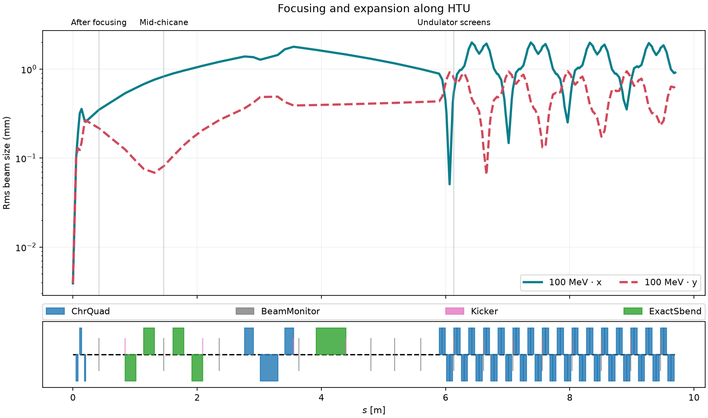

:::::::::::::::::::::::::::::::::::::: questions

- 🧲 How do magnets guide and focus an electron bunch?
- 🔍 How can beam screens reveal changes along a beamline?
- 🧩 What changes when we track independent particles instead of evolving a plasma?

::::::::::::::::::::::::::::::::::::::::::::::::

::::::::::::::::::::::::::::::::::::: objectives

- Identify drifts, quadrupoles, dipoles, and diagnostic screens.
- Run an ImpactX simulation and connect beam shapes to the magnet sequence.
- Distinguish particle sampling from physical bunch charge.
- Interpret beam-size plots within the assumptions of the model.

::::::::::::::::::::::::::::::::::::::::::::::::

## From an electron source to a beamline

An electron bunch needs guidance after it leaves its source. Magnets steer
its trajectory and focus it toward the next experiment. Here, ImpactX tracks
a bunch through the **Hundred-Terawatt Undulator (HTU)** beamline at LBNL's
BELLA Center, using the magnet sequence from the
[ImpactX HTU example](https://impactx.readthedocs.io/en/latest/usage/examples/htu_beamline/README.html).
See [Introduction to ImpactX](introduction-impactx.Rmd) for the beam-dynamics
background.
The bunch in this example is sampled from a Gaussian distribution.

## The bunch and its numerical representation

| Setting | Default | Notebook variable |
| --- | --- | --- |
| Particle species | Electrons | Reference particle charge and mass |
| Bunch and reference total energy | 100 MeV, including rest energy | `reference_total_energy_MeV` |
| Bunch charge magnitude | 25 pC | `bunch_charge=25e-12` |
| Number of macroparticles | 10,000 | `particles` |
| Normalized transverse emittance | 1.5 µm in each plane | Gaussian distribution setup |
| Space charge | Off | `sim.space_charge = False` |

Each macroparticle represents many electrons. Increasing `particles` samples
the same 25 pC bunch more finely; it does not increase its charge.

The notebook defines the reference particle, Gaussian bunch, lattice, and
tracking calls in `run_beam`. The reference-particle API takes **kinetic**
energy, so the code subtracts electron rest energy from the specified total
energy. The `twiss(...)` call supplies distribution parameters; dividing
normalized transverse emittance by βγ gives geometric emittance.

Particles move through prescribed magnets without collective fields. Space
charge, radiation, and apertures are not modeled. The screens record the
beam without clipping it, so a charge check cannot establish whether the
beam would fit through real openings.

## Get ready to run

Use the [tutorial setup instructions](./files/llnl-hpc-2026/README.md#usage)
for Docker or Conda. They provide ImpactX, Jupyter, and the analysis packages.
For independent use, the files live in
`episodes/files/beam-transport/`:

- [htu_transport.ipynb](./files/beam-transport/htu_transport.ipynb)
  defines and runs the simulation.
- [impactx_helpers.py](./files/beam-transport/impactx_helpers.py)
  provides analysis and plotting utilities. Keep it alongside the notebook.

If you downloaded only the workshop folder during setup, obtain the standalone
example from the repository root with:

```bash
git sparse-checkout add episodes/files/beam-transport
```

In the tutorial container or a full repository checkout, the example is
already included.

The first code cell downloads `htu_lattice.py` from the pinned ImpactX
26.09 example if it is missing, so the first run needs network access.
Existing local copies are kept. The lattice uses its default chicane setting.

For the hosted workshop, follow the
[LLNL launch instructions](llnl-hpc-2026.Rmd#exercise-3-track-an-electron-beam-through-a-real-beamline).

## Track the bunch

Open the notebook from `beam-transport/` and select a kernel with
ImpactX and the analysis packages. In the tutorial container this is
**WarpX CPU**, which includes ImpactX. Keep the default particle count and
energy, and run sections 1–3 in order.

The simulation runs directly in the notebook kernel. Each call creates a
new `transport-*` folder under `beam-transport/runs/`, containing diagnostics and
`performance.json`. The reported runtime covers setup, particle generation,
tracking, and diagnostic output; it excludes kernel startup and plotting.
`run_beam` requests two CPU threads via `sim.omp_threads`; pass
`cpu_threads=4`, for example, to change that.

After changing settings, rerun the settings cell, the simulation call, and
the analysis cells. If you edit `run_beam` itself, rerun its definition too.

## Interpret the results

First open a saved screen with the notebook's diagnostic-reading cells.
An openPMD series contains iterations and particle species. The `beam`
species is loaded into a table with one row per macroparticle. Extract
transverse positions and weights, then plot a charge histogram with
Matplotlib. Colors show **charge magnitude per bin**, not charge density
per unit area.

Use **Play screens** or the slider to follow the bunch along the beamline.
These are snapshots at different locations, not a movie in physical time.
Turn off **Zoom to fit** to compare sizes on fixed axes; zoomed maps can
switch between µm and mm. The viewer also saves `beam_explorer.html` in the
run folder, which can be opened in a browser.

{alt="Horizontal and vertical rms beam sizes versus distance, with screen landmarks identifying focusing, the chicane, and the undulator."}

The **rms sizes** describe the spread of particle positions in x and y.
The magnet diagram below the curves shows where the beamline elements sit:

- **Drifts:** particles travel without magnetic forces. Depending on their
  incoming angles, the bunch can expand or converge to a waist.
- **Quadrupoles:** focus in one transverse plane and defocus in the other.
  Alternating quadrupoles control both planes; compare the waist locations
  in x and y.
- **Chicane dipoles:** bend the beam through a sideways detour. Different
  momenta bend differently, coupling horizontal position to momentum.
- **Screens:** record the beam at selected locations in this model.

Find `TCPhosphor` after the initial focusing magnets, `ChicaneSlit` in the
chicane, and the exit. A size change can develop downstream of the magnet
that changed the particle angles.

::::::::::::::::::::::::::::::::::::: challenge

### Follow the beam

Does the beam stay round? Where is it narrowest in each plane? Connect
these changes to the nearby magnets and drifts using both the screen
histograms and the rms-size curves.

::::::::::::::::::::::::::::::::::::::::::::::::

::::::::::::::::::::::::::::::::::::: challenge

### Change the beam energy

Change `reference_total_energy_MeV`, then rerun the settings, simulation,
and analysis. This changes both the reference energy and the center of the
bunch distribution. The lattice keeps its default settings; changing the
energy does not retune the magnets. How do the beam sizes and waist
locations change?

::::::::::::::::::::::::::::::::::::::::::::::::

::::::::::::::::::::::::::::::::::::: challenge

### Sample the same bunch more finely

Increase `particles`, keeping the other settings fixed. Compare the beam's
sampled shape, runtime, and output size. Which features persist? A smoother
histogram alone does not validate the physical model.

::::::::::::::::::::::::::::::::::::::::::::::::

## Connecting to a plasma accelerator

Replacing this Gaussian bunch with a plasma-generated source would require
selecting the bunch and matching coordinate and momentum conventions.
Energy spread, transverse size, divergence, emittance, and charge would all
matter for transport. The current examples do not perform that handoff.

::::::::::::::::::::::::::::::::::::: keypoints

- 🧲 Magnets change particle trajectories; drifts allow those changes to develop into different beam sizes.
- 🔍 Screen histograms and rms-size curves connect the bunch to the lattice.
- 🧩 More macroparticles sample the same bunch more finely.
- 📏 The model omits collective fields, radiation, and apertures; interpret its diagnostics within those limits.

::::::::::::::::::::::::::::::::::::::::::::::::
