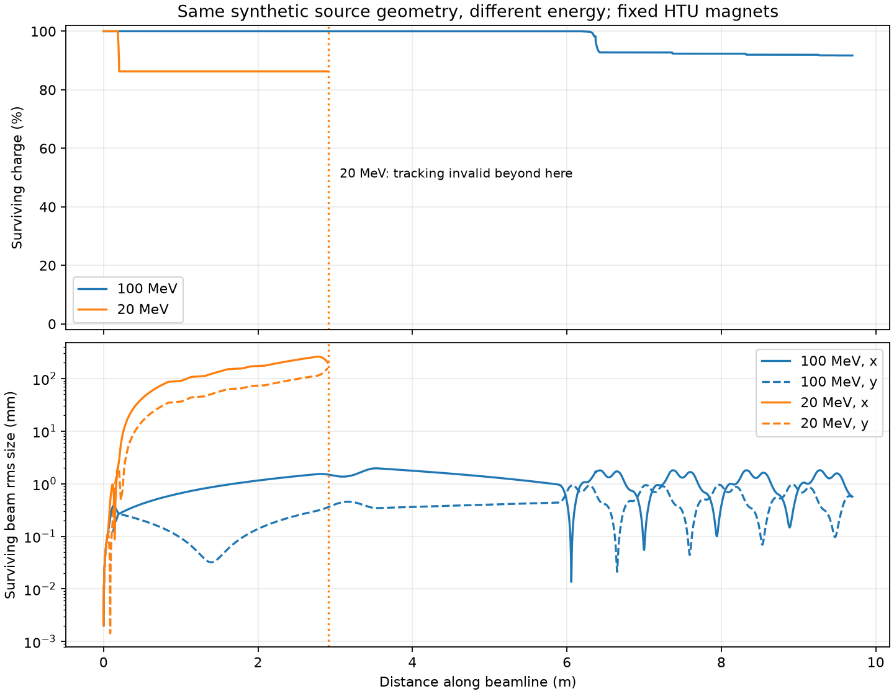

:::::::::::::::::::::::::::::::::::::: questions

- 🔬 What are WarpX and ImpactX?
- 🔍 What can they reveal about plasmas and particle beams?
- 🧩 How do numerical details turn into computing work?
- 🚀 How do we launch, measure, and explore a simulation on CPU or GPU?

::::::::::::::::::::::::::::::::::::::::::::::::

::::::::::::::::::::::::::::::::::::: objectives

- 💡 Connect each physical system to the numerical model used by the code.
- 🚀 Learn how to run WarpX and ImpactX simulations on CPU and GPU.
- ⏱️ Read simulation logs, extract timing information, and interpret physics diagnostics.
- 📊 Visualize plasma dynamics and beam transport using saved diagnostics.
- 🔍 Measure what changes when using different numerical parameters.

::::::::::::::::::::::::::::::::::::::::::::::::

## Your route through the tutorial 🗺️

Today we will make electron streams form an instability, launch a laser into a
plasma, and send a beam through magnets. Along the way, keep an eye on what
the computer is doing: how long it takes, which hardware is working, and
how much data it saves. 🔬 💻

Refer to the [introduction to WarpX](introduction.Rmd) for the particle-in-cell
(PIC) method and the physical questions WarpX can help answer.
Refer to the [introduction to ImpactX](introduction-impactx.Rmd) for beam dynamics,
accelerator elements, and the questions ImpactX can help answer. These pages
provide the background for the slides and remain available after the workshop.

Our three stops connect the physics to the computing:

| Exercise | Physical system | Numerical model | Computing activity |
| --- | --- | --- |  --- |
| 🎢 Two-stream instability | Two counter-streaming electron populations | 1D grid with computational particles | Practice running WarpX, reading its log, and plotting output |
| 🏄 Laser wakefield | A laser and plasma evolving | 3D grid with computational particles | Run on CPU and GPU; connect grid size, time steps, and diagnostics to cost |
| 🧲 HTU beam transport | A bunch of electrons tracked through a sequence of magnets | Computational particles | Practice running ImpactX; compare particle counts, runtime, output size, and beam plots |


## Meet your remote machine 💻

Registered participants receive an AWS-hosted JupyterLab link through Slack.
Open that link to access it.
Your remote instance runs a Docker container with the software and tutorial files already installed.
Your browser is the interface: the simulation and its files live on the
remote machine.

Start by finding out where you landed. Open **File > New > Terminal** in
JupyterLab and run:

```bash
pwd             # show the working directory
ls              # list the files in the current directory
lscpu           # show CPU specs
nvidia-smi      # show NVIDIA GPU and its memory
which python    # show the active Python executable
which warpx.1d  # see if and where the 1D executable is
which warpx.3d  # see if and where the 3D executable is

```

📝 Keep a small run record as you go: **hardware, input settings, elapsed
time, output size, and one observation from the plots**. Those notes will
help you explain differences between runs.

The hosted image provides two Python environments:

| Where you work | CPU | GPU |
| --- | --- | --- |
| Jupyter notebook:<br>**Kernel > Change Kernel** | **WarpX CPU** | **WarpX GPU** |
| Terminal activation command | `source /opt/venv-cpu/bin/activate` | `source /opt/venv-gpu/bin/activate` |

💡 **Two places to choose your environment:** both environments include
ImpactX as well as WarpX. Selecting a notebook kernel does **not** change
the environment in an already open terminal.

::: caution

### Keep your previous results

The codes reuse `diags/` for output. Before repeating a run, rename that
folder or copy the exercise files into a separate run folder. Keep a copy
of the input settings with each result.

:::

### Joining from your own machine? 🏠

To run the tutorial on your own machine, follow the
[Docker or Conda setup instructions](https://github.com/BLAST-WarpX/warpx-tutorials/blob/main/episodes/files/llnl-hpc-2026/README.md#usage).
Choose one of these two options:

- **Docker:** run the provided image, which includes the software and tutorial
  files. See the [container documentation](https://github.com/BLAST-WarpX/warpx-tutorials/blob/main/containers/tutorial/README.md)
  for GPU access or instructions to build the image yourself.
- **Conda:** download the complete tutorial folder and create an environment
  using its `environment_setup.yml` file, as described in the setup instructions.
  Keep the scripts, inputs, and notebooks together.

The `/opt/venv-*` activation commands above apply to the hosted instance and
the provided Docker image. With Conda, use
`conda activate llnlhpc26-warpx-tutorial` instead.


## Exercise 1: induce a famous plasma instability

🎢 Start with two electron populations moving in opposite directions at one tenth of the
speed of light. Small density variations create an electric field, which
influences the electron motion and can make those variations grow. This
feedback is the **two-stream instability**. Eventually particles become
trapped in the wave and the rapid growth levels off.

WarpX simulates this motion along one spatial direction, **z**, on a
periodic grid: particles leaving one end re-enter at the other. A stationary
positive background is assumed; ions are not tracked explicitly. This small
example introduces the PIC particle–field update cycle.

### Launch your first run 🚀

In a terminal with the CPU environment active, start from the
`llnl-hpc-2026` tutorial directory:

```bash
cd two_stream_instability
ls
export OMP_NUM_THREADS=4  # matches the 4 vCPUs on the AWS instance.
```

You can launch the same simulation using either the
[Python script](./files/llnl-hpc-2026/two_stream_instability/run_two_stream_instability.py)
or the `warpx.1d` executable. Both read the same
[input file](./files/llnl-hpc-2026/two_stream_instability/two_stream_instability_input.txt).
Choose **one** of the commands below for your first run.

```bash
# Option 1: Python
python run_two_stream_instability.py

# Option 2: WarpX executable
warpx.1d two_stream_instability_input.txt
```

Wait for the simulation to finish.
Check the output for errors and find the **TinyProfiler total time** near the end.
Then check the disk space used by the diagnostics:

```bash
du -sh diags
```

Record the TinyProfiler total time and output size.

:::::::::::::::::::::::::::::::::::::::::: spoiler

### 💡 Optional: timing and saving output

To include Python startup in the timing, launch your run with:

```bash
time python run_two_stream_instability.py
```

The **real** value in the terminal is the elapsed wall-clock time.

To save standard output and errors to `run.log`, choose one command:

```bash
# Option 1: Python
python run_two_stream_instability.py > run.log 2>&1

# Option 2: WarpX executable
warpx.1d two_stream_instability_input.txt > run.log 2>&1
```

`> run.log 2>&1` sends both to the file, overwriting any existing log.

::::::::::::::::::::::::::::::::::::::::::::::::::

### Peek under the hood 🔧

Open the input file in JupyterLab's editor and find the settings below.
You do not need to decipher every line: first locate the grid, particles,
and output controls. Keep their values unchanged for this run.

| Setting | Meaning in this run |
| --- | --- |
| `geometry.dims = 1` | Fields vary along one spatial direction |
| `my_constants.nx = 256` | The domain has 256 grid cells |
| `ele1.num_particles_per_cell = 200` and the equivalent `ele2` setting | Each cell initially samples each electron population with 200 macroparticles |
| `stop_time = T` | End at the specified physical simulation time |
| `particles.intervals` | How often particle snapshots are written |
| `my_constants.cfl = 0.9` | Time step as a fraction of the CFL limit |

This input describes 256 × 200 × 2 = **102,400 macroparticles**. They
represent many more physical electrons, depending on the value of the density.
At each step, WarpX updates particle motion and fields and, when requested, writes a snapshot.

For this 1D setup, the time step is $\Delta t = \mathrm{cfl}\,\Delta z/c$.

### Spot the instability 📈

Open [two_stream_instability_plots.ipynb](./files/llnl-hpc-2026/two_stream_instability/two_stream_instability_plots.ipynb)
from the `two_stream_instability` folder and select **WarpX CPU**. Run its
cells after the simulation finishes. The notebook displays the final phase-space snapshot and the field-energy history.

A **phase-space plot** shows position on one axis and momentum on the other.
Here they are $z$ and $p_z/(m_ec)$, the longitudinal momentum divided by the electron mass and
the speed of light. Plot other phase-space snapshots to see the evolution of the two populations.
Initially, they are separate streams. How do they evolve?

.](https://gist.github.com/user-attachments/assets/0160a10a-9a08-443c-84a3-610a9a5eeb73){alt="Two electron streams roll into loops in position–momentum space as particles become trapped in a wave."}

The notebook also plots field energy over
**physical time**. Look for the electric field energy to rise and then level
off. This time axis describes the plasma's evolution, not how long the
computer ran.

::::::::::::::::::::::::::::::::::::: challenge

### Experiments

**Physics**

Describe what you see 👀.
What evidence of the two-stream instability can you identify in the final
phase-space snapshot and the field-energy history?

**Computing**

Save your baseline results. Change one setting at a time, keeping all others
fixed, and rerun the simulation and plotting cells.

1. Change `my_constants.nx`. How do particle count,
   number of steps, runtime, and output size change?
2. Restore the baseline, then change `my_constants.cfl`.
   How do runtime and the plots compare at the same physical time?
   Can you trust the results just because the run finishes?

::::::::::::::::::::::::::::::::::::::::::::::::

::: callout

### Physical or numerical instability?

The **two-stream instability is physical**: energy from the electron streams
feeds a growing electric field. **Numerical instability** is artificial
growth of numerical errors, for example when the time step exceeds the CFL
limit. Growing field energy alone is not enough to distinguish them:
perform convergence tests to check whether the behavior persists with a smaller time step and finer grid.

:::

The input file, execution log, output, and analysis notebook make up the four parts of a simulation workflow,
and we will use them again in the next exercise.


## Exercise 2: accelerate electrons with a laser

🏄 In **laser-wakefield acceleration (LWFA)**, an intense laser pulse pushes
plasma electrons aside, leaving a wave behind it. Electrons caught in this
wake can gain energy from its electric field. WarpX follows the laser,
particles, and fields on a 3D grid. See
[A Laser Wakefield Accelerator](a-laser-wakefield-accelerator.Rmd) for more details.

This and the next exercise illustrate two stages: accelerating electrons in
plasma and transporting a beam through magnets. The folder name `htu` refers
to the **Hundred-Terawatt Undulator**, a beamline at LBNL's BELLA Center used
in the [ImpactX example](https://impactx.readthedocs.io/en/latest/usage/examples/htu_beamline/README.html).
Our small wakefield demonstration runs independently of that beam-transport
example; its output is not passed to ImpactX.

### Launch your first run 🔦

Start from the `llnl-hpc-2026` tutorial directory. If you are still in
`two_stream_instability/`, run `cd ..` first. The wakefield files are included
in this tutorial; no separate download is needed.

```bash
cd htu/lwfa_warpx
source /opt/venv-gpu/bin/activate
```

Choose one command. Both use the same
[input file](./files/llnl-hpc-2026/htu/lwfa_warpx/lwfa_warpx_input.txt):

```bash
# Option 1: Python
python run_lwfa_warpx.py

# Option 2: WarpX executable
warpx.3d lwfa_warpx_input.txt
```

In a second terminal, inspect GPU usage with `nvidia-smi` while the run
progresses. Once it finishes, check for errors and record the **TinyProfiler
total time** and output size:

```bash
du -sh diags
```

GPU execution requires a GPU-enabled WarpX build. CPU execution is also
possible but can take substantially longer.

### Peek under the hood 🧩

Find these settings in the input file:

| Setting | Meaning in this run |
| --- | --- |
| `my_constants.nx`, `ny`, `nz` | 32 × 32 × 512 = **524,288 grid cells** |
| `my_constants.lambda0` | Laser wavelength: **0.8 µm** |
| `my_constants.a0` | Laser strength: **3.0** |
| `warpx.do_moving_window = 1` | The simulation box follows the laser |
| `diag1.intervals = 200` | Save a snapshot every 200 steps |

The box spans **16 × 16 × 20 µm**, with about 20 longitudinal cells per
laser wavelength. Electrons move while helium ions stay fixed. The default
run takes **1,836 steps** of approximately **0.129 femtoseconds** each.

### Find the wake 🏄

Open [wakefield.ipynb](./files/llnl-hpc-2026/htu/lwfa_warpx/wakefield.ipynb) from the
`llnl-hpc-2026/htu/lwfa_warpx` folder and select **WarpX GPU**. It analyzes the completed run;
it does not launch a simulation or require GPU acceleration.

Use the [plot guide](a-laser-wakefield-accelerator.Rmd#interpret-the-results) to identify
the electron-depleted cavity, accelerating field, and electron energy
distribution. Explore snapshots during propagation: the final frame is
after the moving window has left the plasma.

::::::::::::::::::::::::::::::::::::: challenge

### Experiments

**Physics**

Describe what you see 👀.
Where is the wake relative to the laser? What evidence do you see that
electrons gain energy? How does the wake change as it crosses the plasma?

**Optional: regular versus random particle placement**

The raw electron histogram can show horizontal stripes: the baseline places
one macroparticle per cell on a regular grid, and the histogram bins resolve
those rows. Try randomizing the electron positions within each cell.
In `lwfa_warpx_input.txt`, replace

```text
electrons.injection_style = "NUniformPerCell"
electrons.num_particles_per_cell_each_dim = 1 1 1
```

with

```text
electrons.injection_style = "NRandomPerCell"
electrons.num_particles_per_cell = 1
```

Remove the old `num_particles_per_cell_each_dim` line. Keep the density,
grid, momentum distribution, and other settings fixed. These two loading
styles use [different particle-count parameters](https://warpx.readthedocs.io/en/latest/usage/parameters.html#particle-initialization).

Preserve the baseline diagnostics before rerunning. Compare the electron
histogram and deposited-density plot at the same saved step. Do the regular
bands disappear? How much random variation appears instead?

This keeps one macroparticle per cell but changes its position. Random loading
can replace regular sampling patterns with statistical noise and can affect
the simulated fields, especially at this low particle count. A less striped
plot alone does not demonstrate greater physical accuracy.

**Computing**

1. Change the grid spacing in all three directions, keeping the physical box size and other settings fixed.
How do the cell count and workload change?
2. Run the same case on CPU. How does the time per step compare with GPU?

::: callout

On HPC for highly parallel simulations, grid cells are blocked together for parallel [Domain Decomposition](https://warpx.readthedocs.io/en/latest/usage/workflows/domain_decomposition.html).
The example's inputs set `amr.blocking_factor = 16`, thus use multiples of 16 for grid cells `nx`, `ny`, and `nz`.
A smaller `dz` also shortens the time step, so the run needs more steps.

:::

::::::::::::::::::::::::::::::::::::::::::::::::


## Exercise 3: track an electron beam through a real beamline

🧲 Once a beam is created, magnets steer and focus it. Here, ImpactX tracks
an independent electron bunch through the **HTU beamline**, using the
[upstream example](https://impactx.readthedocs.io/en/latest/usage/examples/htu_beamline/README.html)
with **100 MeV total energy** and **25 pC charge**.

Quadrupole magnets focus the beam, while a **chicane** of bending magnets
sends it along a sideways detour. ImpactX tracks particles through these
prescribed magnets. **Space charge is off**: particles do not interact
through their own fields.

### Launch your first run 🧲

Open [htu_transport.ipynb](./files/llnl-hpc-2026/htu/beamline_impactx/htu_transport.ipynb) from
`llnl-hpc-2026/htu/beamline_impactx/` in JupyterLab and select **WarpX CPU**. This notebook launches the simulation as
well as plotting its results. Keep the default settings and run steps 1–3.
Record the reported runtime and output size. Each run gets a new folder
under `llnl-hpc-2026/htu/runs/`.

### Peek under the hood 🧩

Find these settings in the notebook:

| Setting | Meaning in this run |
| --- | --- |
| `particles = 10000` | Number of macroparticles sampling the bunch |
| `total_energies_MeV = [100]` | Beam total energy, including rest energy, in MeV |
| `chicane_r56_um = 200.0` | Chicane control setting, in µm |

The notebook shows the ImpactX setup, reference particle, Gaussian bunch, lattice,
and tracking calls in a function that runs directly in the notebook kernel. It downloads the upstream
`htu_lattice.py` for the magnet sequence. The
[helper script](./files/llnl-hpc-2026/htu/beamline_impactx/impactx_helpers.py) handles
analysis and plots. Increasing the macroparticle count samples the
same **25 pC** bunch more finely; it does not increase its charge.

### Explore the beam screens 🔍

First use the notebook’s diagnostic-reading cells to open a saved screen, extract
particle coordinates and weights, and plot a charge histogram with Matplotlib.
Then use **Play screens** or the slider to follow the transverse beam shape.
Turn off **Zoom to fit** to compare sizes on fixed axes.

{alt="Horizontal and vertical rms beam sizes versus distance, with screen landmarks identifying focusing, the chicane, and the undulator."}

The **rms sizes** describe the spread of particle positions in x and y.
The magnet diagram below the curves shows where the beamline elements sit.
Apertures are not modeled, so the charge check does not tell you whether
this beam would fit through real openings.

::::::::::::::::::::::::::::::::::::: challenge

### Experiments

**Physics**

Describe what you see 👀. Does the beam stay round? Where is it narrowest
in each plane? How do changes in beam size relate to the nearby magnets?

What would happen if you replaced the initial ImpactX bunch with the beam
produced by WarpX in Exercise 2? Which beam properties would affect its
transport through the same magnets?

**Computing**

Try increasing `particles` in the notebook settings, keeping the other settings
fixed, then rerun the simulation and beam viewer. How does the beam's sampled
shape change? Record the runtime and output size, without assuming either
scales in direct proportion to particle count.

::::::::::::::::::::::::::::::::::::::::::::::::

:::::::::::::::::::::::::::::::::::::::::: spoiler

### Optional: change the beam energy

Set `particles = 10000`, `total_energies_MeV = [100, 150]`, and
`chicane_r56_um = 0.0`, then rerun the settings cell, simulation, and beam viewer.
How does beam transport change with energy when the magnets stay fixed?

Both runs have zero chicane field. The 150 MeV bunch also starts with
smaller angular divergence and relative energy spread.

::::::::::::::::::::::::::::::::::::::::::::::::::

## What changes when the simulation gets larger? 🌍

These examples fit on one machine. A larger plasma, finer grid, or more
particles may require more memory or take too long to simulate. On a
supercomputer, we can distribute that work across multiple machines
(**compute nodes**) using MPI.

More hardware also means exchanging data between processes and keeping
them all busy. The question becomes: **how much faster does the same
simulation run when we give it more resources?** This is a scaling study.
Our container has no MPI support, so we have explored workload and CPU/GPU
performance here, but not scaling across nodes.

::::::::::::::::::::::::::::::::::::: challenge

### Plan a larger run 💬

Choose one exercise. If you made it much larger, what would become the
main limitation: runtime, memory, or output size? Use your measurements
to explain your prediction. How would you test whether adding more CPUs
or GPUs helps?

::::::::::::::::::::::::::::::::::::::::::::::::

## Keep exploring: connect the codes 🔗

A larger study can pass a plasma-generated bunch from WarpX to ImpactX.
That requires a resolved source, a suitable particle selection, and consistent
coordinate conventions. It is outside these exercises: a high-energy tail alone does not establish
a usable beam. The two notebooks use independent sources.

::::::::::::::::::::::::::::::::::::: keypoints

- 🧩 Physics and numerical representation determine the workload; hardware
  determines how that workload is executed.
- 📝 Record the input, hardware, elapsed runtime, and output alongside the plots.
- 💾 More particles, finer grids, and more frequent diagnostics have different
  scientific benefits and computational costs.
- 🔍 Compare the same problem to measure a hardware speedup; compare physical
  observables to judge whether a numerical change matters scientifically.

::::::::::::::::::::::::::::::::::::::::::::::::
