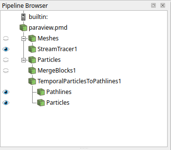

:::::::::::::::::::::::::::::::::::::: questions 

- 🤌 What is WarpX? 
- 🔧 How can I install and run WarpX?
- 🕵️ How can I analyze the simulation results?

::::::::::::::::::::::::::::::::::::::::::::::::

::::::::::::::::::::::::::::::::::::: objectives

- 💻 Install WarpX on your local machine with [Conda](https://docs.conda.io/en/latest/)
- 🏃 Run a fusion-relevant example on your local machine: protons in a magnetic mirror!
- 👀 Visualize the results with `python` and `Paraview`

::::::::::::::::::::::::::::::::::::::::::::::::

## WarpX, a particle-in-cell code

Welcome to the WarpX tutorial at [OSSFE 2025](https://ossfe.github.io/)! 👋

[WarpX](https://github.com/BLAST-WarpX/warpx) is a general purpose **open-source** **high-performance** **Particle-In-Cell** (PIC) code.  
If you are not familiar with the PIC method, here is a picture that condenses the core idea:  

{alt="macroparticles in the cells of a grid"}

And here is a more informative image that explains the core algorithmic steps.

{alt="pic loop"}

If you want to know more about PIC, here are a few **references**:

*  The two bibles on PIC 📚
     *  [C. K. Birdsall and A. B. Langdon. Plasma Physics Via Computer Simulation.](https://doi.org/10.1201/9781315275048)  
     *  [R. W. Hockney and J. W. Eastwood. Computer simulation using particles.](https://doi.org/10.1201/9780367806934)  
*  An old review written by one of the pioneers: [John M. Dawson, Particle simulation of plasmas, Rev. Mod. Phys. 55, 403](https://doi.org/10.1103/RevModPhys.55.403)  
*  Browse our docs for [many more references about advanced algorithms and methods](https://warpx.readthedocs.io/en/latest/theory/pic.html).

In this tutorial we will go through the **basics of WarpX**: installation, running a simple example and visualizing the results. 
Along the way, we will point to some specific locations in the documentation, for your reference.

::: callout
📣 Everything you need to know to use WarpX is in the [documentation](https://warpx.readthedocs.io/en/latest/index.html), check it out!
:::

::::::::::::::::::::::::::::::::::::::::::::::: checklist

Some cool features of WarpX:  

 📖 Open-source - we wouldn't be here otherwise!  

 ✈️ Runs on GPUs: NVIDIA, AMD, and Intel  

 🚀 Runs on multiple GPUs or CPUs, on systems ranging from laptops to supercomputers  

 🤓 Advanced algorithms and methods: mesh-refinement, embedded boundaries, electrostatic/electromagnetic/pseudospectral solvers, etc.  
 
 💾 Standards: [openPMD](https://www.openpmd.org/#/start) for input/output data, [PICMI](https://github.com/picmi-standard/picmi) for inputs  

 🤸 Active development and mainteinance: check our [GitHub repo](https://github.com/BLAST-WarpX/warpx)  

 🗺️ International, cross-disciplinary community: plasma physics, fusion devices, laser-plasma interactions, beam physics, plasma-based acceleration, astrophysics 
 
:::::::::::::::::::::::::::::::::::::::::::::::::::::::::

## Installing WarpX using Conda-Forge

First, you need a **Conda** installation and we will assume that you indeed have one.  
If not, follow the [instruction at this link](https://docs.conda.io/projects/conda/en/stable/user-guide/install/index.html#regular-installation).  
You can install Conda on most operative systems: **Windows, macOS, and Linux**.  
We will also assume you have some familiarity with the **terminal**. 
Once you have Conda on your system, **WarpX is available as a package** via [Conda-Forge](https://conda-forge.org/download/).  
The installation is a **one-liner** 😌!

::: callout
```bash
conda install -c conda-forge warpx 
```
:::

Ok, maybe two lines if you want to keep your system clean by creating a new **environment**. 

```bash
conda create -n warpx -c conda-forge warpx 
conda activate warpx 
```

Now you should have 4 different WarpX binaries in your `PATH` called `warpx.1d`, `warpx.2d`, `warpx.3d`, `warpx.rz`.  
Each binary for a different dimensionality.  

To check this, run:
```bash
which warpx.1d warpx.2d warpx.3d warpx.rz
```
If you get 3 different paths that look something like:
```bash
/home/<username>/anaconda3/envs/warpx/bin/warpx.xd
```
then you got this 🙌! You can also import `pywarpx` in `python`


## A simple example of a magnetic mirror

In this example we will simulate a bunch of **protons inside a magnetic mirror machine**. 
The protons are initialized with random positions and velocities. 
The magnetic field is loaded from a `.h5` file.
Make sure to download the [input file](./files/inputs_3d_magnetic_mirror.txt). 

Whenever you need to prepare an input file, [this is where you want to go](https://warpx.readthedocs.io/en/latest/usage/parameters.html).
By the way, analytics tell us that this is the most popular page of the documentation 👠! 

:::::::::::::::::::::::::::::::::::::::::: spoiler

### Let's take a look at the input file

```{r engine='bash', echo=FALSE, comment=''}
cat ./files/inputs_3d_magnetic_mirror.txt
```
::::::::::::::::::::::::::::::::::::::::::::::::::

Now that we have an idea of what the input files looks like, let's set up our environment.
Activate the `warpx` environment if you need to.
Create a new directory with your own copy of the input file. 
Also, don't forget to [download the field file](../files/example-femm-3d.h5) and place it in the directory where you will run the input. 

::::::::::::::::::::::::::::::::::::: challenge

## Let's run the code

How would you do it? 🤷

:::::::::::::::: solution

```bash
warpx.3d inputs_3d_magnetic_mirror.txt
```
:::::::::::::::::::::::::
:::::::::::::::::::::::::::::::::::::::::::::::


You should see a standard output flashing out a lot of info.  
At the end, you should find in your folder:

  * a subfolder called `diags`: here is where the code stored the diagnostics  
  * a file called `warpx_used_inputs`: this is a summary of the inputs that were used to run the simulation  

If that's the case, yey! 💯  

If the run went wrong, you may find a `Backtrace.0.0` file which can be useful for debugging purposes. 
Let me know if the code fails in any way! 

Here we have loaded the field of hte magnetic bottle from a file.
You can also you can [define an external field analytically](https://warpx.readthedocs.io/en/latest/usage/parameters.html#applied-to-particles).


## Visualizing 

### With python 🐍

Now that we have the results, we can analyze them using `python`.  
We will use the [openPMD-viewer](https://openpmd-viewer.readthedocs.io/en/latest/) library to grab the data that the simulation produced in `openPMD` format. 
Here you can find [a few great tutorials on how to use the viewer](https://openpmd-viewer.readthedocs.io/en/latest/tutorials/tutorials.html).
If you feel nerdy and/or you need to deal with the data in parallel workflows, you can use the [openPMD-api](https://openpmd-api.readthedocs.io/en/latest/).

:::::::::::::::::::::::::::::::::::::::::: spoiler

Let's take a look at a simple Jupyter notebook where we retrieve the magnetic field and the particle attributes at the end of the simulation.
With a little bit more work, we also plot the trajectories of the particles.

```{r, results='asis', echo=FALSE}
cat('<iframe src="https://nbviewer.org/github/aeriforme/warpx-tutorials/blob/main/episodes/files/analysis_3d_magnetic_mirror.ipynb" 
           width="100%" height="800" style="border:none;">
     </iframe>')
```
::::::::::::::::::::::::::::::::::::::::::::::::::


You can [download the notebook](../files/analysis_3d_magnetic_mirror.ipynb) and try it yourself.
Remember to either run the notebook from the simulation directory or change the corresponding path in the notebook.

### With Paraview

Now it's time to produce some pretty cool images and videos! 😎
If you don't have it, you can [download Paraview here](https://www.paraview.org/download/).
In the `diags/diag1` directory you should find a file named `paraview.pmd`: Paraview can read `.pmd` files.
Just open Paraview and from there open the `.pmd` file.
You should see `Meshes` and `Particles` in your pipeline browser (usually on the left).
We can zhuzh up the pipeline so that we can visualize the trajectories of the protons in time

This is the pipeline that I have used to produce the visualizations below.

{alt="paraview pipeline"}

{alt="simulation of proton trajectories inside a magnetic mirror"}

<iframe src="https://drive.google.com/file/d/1HhY2bL4kzkKoNp9eCkdI6S3m49JXUKsx/preview" width="100%" height="500" allow="autoplay"></iframe>


If you make any other 3D visualization with this data, let me know! We can add it here 😉!

And that's all for now! 👋

::::::::::::::::::::::::::::::::::::: keypoints 

 📖 [**WarpX**](https://ecp-warpx.github.io/) is a open-source high-performance particle-in-cell code  

 🔧 WarpX is **easy to install via Conda**: `conda -c conda-forge warpx`  

 🔍 The [**documentation**](https://warpx.readthedocs.io/en/latest/) is the first place to look for answers, otherwise check out our [**issues**](https://github.com/BLAST-WarpX/warpx/issues) and [**discussions**](https://github.com/BLAST-WarpX/warpx/discussions).   

 👀 To visualize the simulation results in [**openPMD**](http://www.openpmd.org/) format, you can use the [**openPMD-viewer**](https://openpmd-viewer.readthedocs.io/) library for `python` or you can open `.pmd` files directly in [**Paraview**]((https://www.paraview.org/download/)).

::::::::::::::::::::::::::::::::::::::::::::::::
