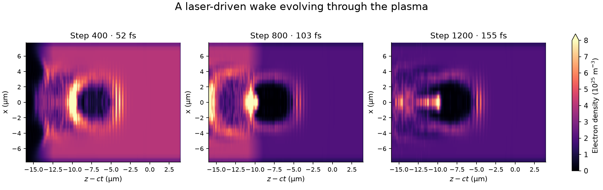
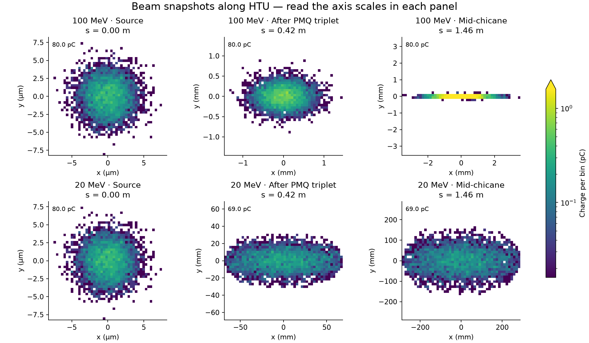

:::::::::::::::::::::::::::::::::::::: questions

- What happens when two groups of electrons move through each other?
- How can a laser create a wave that accelerates electrons?
- Why do the same magnets affect beams of different energies differently?
- How could we pass a beam from one simulation to another?

::::::::::::::::::::::::::::::::::::::::::::::::

::::::::::::::::::::::::::::::::::::: objectives

- Set up the software environment shared by all three exercises.
- Run a small one-dimensional (1D) simulation and plot how the electrons move.
- Run a small three-dimensional (3D) plasma simulation and plot electron
  density, electric fields and the distribution of electron energies.
- Use ImpactX to follow two example electron beams through accelerator magnets.
- Recognize when particles are lost and when a simulation stops giving valid results.
- Describe the extra steps needed to pass a beam from WarpX to ImpactX.

::::::::::::::::::::::::::::::::::::::::::::::::

## Overview


This tutorial starts with a small warm-up, followed by two independent visual
examples: a plasma wake in WarpX and beam transport in ImpactX. An optional
section explains how the two codes can be coupled for a more detailed study.

We will use two simulation tools. **WarpX** models charged particles and the
electric and magnetic fields that act on them. Its **particle-in-cell (PIC)**
method represents many real particles with each simulated particle and computes
fields on a grid. **ImpactX** follows a beam through a sequence of accelerator
components, such as magnets.

1. **Two streams of electrons** (`two_stream_instability`). Start with a
   quick 1D run: two groups of electrons move in opposite directions and
   develop a wave. This also checks that your simulation and plotting tools
   work. The standalone [Two-Stream Instability](a-two-stream-instability.Rmd)
   episode lets you explore the parameters in more detail.
2. **A laser-driven plasma wake** (`htu/lwfa_warpx`). Watch a short laser
   pulse push electrons aside and leave a wave behind it. Plot where the
   electrons are, the electric field and their energies.
3. **An electron beam passing through magnets** (`htu/beamline_impactx`).
   Compare two computer-generated beams with energies of 100 MeV and 20 MeV.
   MeV means million electronvolts, a unit of particle energy. The magnets
   come from a model of the **Hundred Terawatt Undulator (HTU)** experiment.
   Watch the beam shapes change and see which particles reach the end.

The wakefield and magnet examples run independently; neither needs output
from the other. Coupling them is an optional extension.

WarpX reads the settings from a plain-text input file using a short Python
script. ImpactX uses a Python script to define the sequence of magnets,
called a **lattice**, following the
[ImpactX HTU beamline example](https://impactx.readthedocs.io/en/latest/usage/examples/htu_beamline/README.html).
You can run both examples from the supplied notebooks without writing code.

Use the [WarpX notebook](./files/llnl-hpc-2026/htu/wakefield.ipynb) and the
[ImpactX notebook](./files/llnl-hpc-2026/htu/htu_transport.ipynb) independently.
Each focuses on running one example and visualizing its result. Optional
coupling is explained at the end of this lesson.

## Access and installation 💻

### Registered participants: open the AWS link from Slack

**Registered participants will receive a link in Slack that opens the
AWS-hosted tutorial session directly in their browser.** Open that link to
start JupyterLab; you do not need to install software on your own computer.
If you registered but cannot find your link, ask the organizers in Slack.

1. Open your session link from Slack.
2. In JupyterLab's file browser, navigate to
   `warpx-tutorials/episodes/files/llnl-hpc-2026/`.
3. Start with `two_stream_instability/two_stream_instability_plots.ipynb`
   after running the warm-up below, or open `htu/wakefield.ipynb` and
   `htu/htu_transport.ipynb` for the two main examples.
4. Select **WarpX GPU** for the wakefield notebook and **WarpX CPU** for the
   ImpactX notebook using **Kernel > Change Kernel**. In the hosted wakefield
   notebook, leave `warpx_executable = None` to use its GPU Python kernel.

The tutorial files and software are provided on the instance. No download is
needed there. If you do not have a session link, or want to work later on your
own machine, keep reading for Docker and Conda instructions.

### Files for your own machine

With Git installed, open a terminal and run these commands to download the
tutorial folder without the other lessons' contents:

```bash
git clone --depth 1 --filter=blob:none --sparse \
  https://github.com/BLAST-WarpX/warpx-tutorials.git
cd warpx-tutorials
git sparse-checkout set episodes/files/llnl-hpc-2026
cd episodes/files/llnl-hpc-2026
```

This is called **sparse checkout**. It keeps the tutorial's directory structure
and includes files in its parent directories. You do not need a packaging
script. The folder contains the notebooks, input files, plotting helpers and
optional converter. Open `htu/wakefield.ipynb` or `htu/htu_transport.ipynb`.
Simulation output files are created when you run the examples.

These commands download the files; use one of the installation options below
to get the software. AWS and Docker users already have the tutorial files.

### Alternative A: run the tutorial Docker image yourself

The image contains WarpX, ImpactX and the Python analysis tools, served as
a browser-based JupyterLab session. To run it locally:

```bash
docker pull ghcr.io/blast-warpx/warpx-tutorials/tutorial:latest
docker run --rm -p 127.0.0.1:3000:3000 ghcr.io/blast-warpx/warpx-tutorials/tutorial:latest
```

Open `http://localhost:3000/lab`, launch a **Terminal**, and go to:

```bash
cd ~/warpx-tutorials/episodes/files/llnl-hpc-2026
```

For a local NVIDIA GPU with the NVIDIA Container Toolkit installed, add
`--gpus all` to the `docker run` command. Select the notebook kernels as above.
In a terminal, switch to the GPU environment with:

```bash
source /opt/venv-gpu/bin/activate
```

The files are included in the image. See the
[tutorial container README](https://github.com/BLAST-WarpX/warpx-tutorials/blob/main/containers/tutorial/README.md)
for GPU access and other image details.

:::::::::::::::::::::::::::::::::::::::::: spoiler

### Alternative B: install locally with Conda

Use this if you want to run the tutorial on your own machine outside of the
Docker image -- e.g. a laptop with no Docker available, or a cluster where
you'd rather use your own Conda installation.

We assume you have a Conda installation available on your machine.
Download the [Conda environment file](./files/llnl-hpc-2026/environment_setup.yml),
open a terminal in the directory containing it, and create the environment:

```bash
conda env create -f environment_setup.yml
```

Activate it with:

```bash
conda activate llnlhpc26-warpx-tutorial
```

The environment installs WarpX and ImpactX from Conda Forge, together with
the Python packages used by the simulations and the analysis notebook. This
tutorial has been tested with WarpX 26.09 and ImpactX 26.09. GPU execution
requires a CUDA-enabled WarpX build; installing this environment alone does
not establish GPU support. The warm-up and ImpactX example also run on CPU.


``` output
name: llnlhpc26-warpx-tutorial
channels:
  - conda-forge
dependencies:
  - python=3.14
  - warpx=26.09
  - impactx=26.09
  - openmpi
  - numpy
  - scipy
  - pandas
  - matplotlib
  - jupyterlab
  - openpmd-viewer
```

When you have finished working, deactivate the environment:

```bash
conda deactivate
```

To remove it completely at a later date, run:

```bash
conda env remove -n llnlhpc26-warpx-tutorial
```

::::::::::::::::::::::::::::::::::::::::::::::::::

## Tutorial 1: two-stream instability warm-up

### What we will simulate

Two groups of electrons move through each other in opposite directions at
one tenth of the speed of light ($\pm 0.1c$, where $c$ is the speed of light).
We follow motion along one direction, $z$. The simulation box is **periodic**:
an electron leaving one end re-enters at the other.

Small variations in electron density create an electric field. That field
changes the electron motion, which can make the density variations grow.
This feedback is the **two-stream instability**. As the wave grows, it can
trap electrons, making them oscillate within the wave. Eventually the rapid
growth levels off, or **saturates**.

All settings are supplied. This small run lets you practice running a
simulation and reading its plots before trying the 3D example. For a closer
look at the physics and how to choose the settings, see the standalone
[Two-Stream Instability](a-two-stream-instability.Rmd) episode.

### Download the files

If you are running from the tutorial Docker image, this is already present
at `~/warpx-tutorials/episodes/files/llnl-hpc-2026/two_stream_instability/`
-- `cd` there and skip to [Read the input file](#read-the-input-file).

Otherwise, create a `two_stream_instability` directory and place the
following files in it:

- [WarpX input file](./files/llnl-hpc-2026/two_stream_instability/two_stream_instability_input.txt)
- [Python driver script](./files/llnl-hpc-2026/two_stream_instability/run_two_stream_instability.py)

### Read the input file

The Python script below loads the settings and starts WarpX:


``` output
#!/usr/bin/env python3
"""Run the 1D two-stream instability warm-up from a raw WarpX input file."""

from pywarpx import warpx

warpx.load_inputs_file("two_stream_instability_input.txt")
warpx.step()
warpx.finalize()
```

:::::::::::::::::::::::::::::::::::::::::: spoiler

### View the WarpX input file


``` output
# Two-stream instability warm-up: a 1D electrostatic PIC problem, used here
# as a quick, cheap first run before the heavier LWFA and beamline stages of
# this tutorial. Two cold-ish electron populations drift through each other
# at +/-beta0*c; the counter-streaming free energy grows an electrostatic
# wave until the beams trap each other and saturate.
#
# All parameters below are fixed (unlike the companion "A Two-stream
# Instability" episode, where you choose them yourself) so this runs in a
# few seconds and gets everyone to a working WarpX + Python + Jupyter
# pipeline before the LWFA stage.

####################
### MY CONSTANTS ###
####################
# PLASMA
my_constants.n0 = 1.e17          # electron density of each beam [m^-3]
my_constants.T0 = 5.*q_e         # thermal energy of each beam [J], from 5 eV
my_constants.v_te = sqrt(T0 / m_e)
my_constants.beta0 = 0.1         # drift velocity of each beam, in units of c
my_constants.omega_pe = sqrt(n0*q_e**2/(m_e*epsilon0))

# BOX: sized to fit ~16 wavelengths of the fastest-growing mode,
# lambda ~ 2*pi*beta0*(c/omega_pe)
my_constants.Lx = 10.*clight/omega_pe
my_constants.nx = 256
my_constants.dx = Lx/nx

# TIME: long enough for the instability to grow and saturate
my_constants.cfl = 0.9
my_constants.T = 100./omega_pe
my_constants.dt = cfl * dx / clight
my_constants.nt = floor(T/dt)

##########################
### GENERAL PARAMETERS ###
##########################
stop_time = T
amr.n_cell = nx nx nx
amr.max_level = 0
geometry.dims = 1
geometry.prob_lo = -0.5*Lx -0.5*Lx  -0.5*Lx
geometry.prob_hi =  0.5*Lx  0.5*Lx   0.5*Lx

##########################
### BOUNDARY CONDITION ###
##########################
boundary.field_lo = periodic periodic periodic
boundary.field_hi = periodic periodic periodic
boundary.particle_lo = periodic periodic periodic
boundary.particle_hi = periodic periodic periodic

################
### NUMERICS ###
################
warpx.cfl = cfl
algo.maxwell_solver = yee
algo.particle_shape = 3
algo.particle_pusher = boris
warpx.use_filter = 1

#################
### PARTICLES ###
#################
particles.species_names = ele1 ele2

ele1.species_type = electron
ele1.injection_style = NRandomPerCell
ele1.num_particles_per_cell = 200
ele1.profile = constant
ele1.density = n0
ele1.momentum_distribution_type = maxwell_boltzmann
ele1.theta_distribution_type = constant
ele1.theta = T0 / (m_e * clight**2)
ele1.beta_distribution_type = parser
ele1.beta_function(x,y,z) = beta0
ele1.bulk_vel_dir = +z

ele2.species_type = electron
ele2.injection_style = NRandomPerCell
ele2.num_particles_per_cell = 200
ele2.profile = constant
ele2.density = n0
ele2.momentum_distribution_type = maxwell_boltzmann
ele2.theta_distribution_type = constant
ele2.theta = T0 / (m_e * clight**2)
ele2.beta_distribution_type = constant
ele2.beta = beta0
ele2.bulk_vel_dir = -z

###################
### DIAGNOSTICS ###
###################
# FULL
diagnostics.diags_names = particles
particles.intervals = floor(nt/200)
particles.diag_type = Full
particles.species = ele1 ele2
particles.fields_to_plot = none
particles.format = openpmd
particles.openpmd_backend = bp
particles.dump_last_timestep = 1
particles.ele1.variables = w z uz
particles.ele2.variables = w z uz

# REDUCED
warpx.reduced_diags_names = FieldEnergy FieldMaximum
FieldEnergy.type = FieldEnergy
FieldEnergy.intervals = 1
FieldMaximum.type = FieldMaximum
FieldMaximum.intervals = 1
```

::::::::::::::::::::::::::::::::::::::::::::::::::

The labels `ele1` and `ele2` distinguish the two electron groups. They have
the same density and temperature, but move in opposite directions. Their
random thermal motion is small compared with their initial streaming speed.

We assume a stationary positive background balances the initially uniform
negative charge. The input does not track ions explicitly, and the electric
field starts at zero. The saved **diagnostics** are simply measurements from
the simulation: electron positions and momenta, plus field energies and
maximum field values. The notebook uses these to show how the instability grows.

### Run WarpX

```bash
python run_two_stream_instability.py
```

(If you are running locally with Conda, activate the environment first:
`conda activate llnlhpc26-warpx-tutorial`.)

This small 1D simulation should finish in seconds on a single CPU process.
When it is done, your directory should contain a `diags/` subfolder with
the saved particle data and field measurements.

### Analyze the results

If you are running from the tutorial Docker image, the notebook is already
present at
`~/warpx-tutorials/episodes/files/llnl-hpc-2026/two_stream_instability/two_stream_instability_plots.ipynb`.
Otherwise, download the
[analysis notebook](./files/llnl-hpc-2026/two_stream_instability/two_stream_instability_plots.ipynb)
into the `two_stream_instability` directory, alongside the input file and
driver script.

Open it with Jupyter:

```bash
jupyter lab two_stream_instability_plots.ipynb
```

You can also [preview the warm-up notebook in your browser](https://nbviewer.org/github/BLAST-WarpX/warpx-tutorials/blob/main/episodes/files/llnl-hpc-2026/two_stream_instability/two_stream_instability_plots.ipynb).


### What to look for 📊

A **phase-space plot** shows position on one axis and momentum on the other.
Here the horizontal coordinate is $z$, and the vertical coordinate is
$u_z = p_z/(m_e c)$: electron momentum along $z$, divided by the electron mass
and the speed of light. Positive and negative values indicate opposite
directions of motion. At these initial speeds, $u_z$ is approximately $v_z/c$.

{alt="Electron position versus longitudinal momentum: the two initially separate streams have rolled into cat-eye-shaped vortices as electrons become trapped in the wave."}

This reference plot is reused from the
[Two-Stream Instability episode](a-two-stream-instability.Rmd); your run may
show different fine details. Initially, the two groups form nearly horizontal
bands. As the instability grows, the bands bend and roll into the loops often
called **cat-eye vortices**. These are loops in position–momentum space, not
circular paths in the physical simulation box.

The notebook plots the last saved particle snapshot and the electric and
magnetic field energies over time. The energy plot uses a logarithmic vertical
axis: exponential growth appears as a straight rising section. Look for the
electric field energy to rise and then level off.

💡 **Try reading the plots together:** the phase-space plot shows how the
electrons move; the field-energy plot shows how much energy the growing wave
stores. Can you identify evidence of the instability in both?

Once both plots work, continue to the laser-driven wake below.

## Tutorial 2: watch a wake in WarpX

A **plasma** contains free electrons and ions. A strong laser pulse pushes
electrons away from its path, leaving the heavier ions behind. The electrons
are pulled back, creating a wake behind the pulse. Its electric field can
accelerate electrons, rather like a water wave carrying a surfer. This is
**laser-wakefield acceleration (LWFA)**.


{alt="Three electron-density slices from the reduced WarpX run show a cavity forming and evolving behind the laser at 52, 103 and 155 femtoseconds."}

*Snapshots from the completed reduced 3D simulation. Read left to right: the
wake forms, crosses the density drop, and continues through the lower-density
plasma. All panels use the same density scale. The horizontal coordinate $z-ct$ moves at the speed of light, keeping the
wake in view; dark regions contain fewer plasma electrons. A femtosecond is
$10^{-15}$ seconds.*


Open [wakefield.ipynb](./files/llnl-hpc-2026/htu/wakefield.ipynb) from the `htu`
folder. Run the simulation, then plot a central slice of electron density,
the electric field along the direction of travel and the energy spectrum
(how many electrons have each energy). Choose a different
saved step to watch the wake develop and pass through the density drop. The
notebook also puts three density snapshots side by side so the evolution is
visible without changing the step manually.

The small 3D model uses a short laser and a dense, short plasma target. It
illustrates wakefield dynamics, not the measured HTU beam. It does not need
to produce a 100 MeV bunch for the next example.

### Files and run commands

Keep these files together (the sparse-checkout commands above do this for you):

- [Wakefield notebook](./files/llnl-hpc-2026/htu/wakefield.ipynb)
- [WarpX input](./files/llnl-hpc-2026/htu/lwfa_warpx/lwfa_warpx_input.txt)
- [Python driver](./files/llnl-hpc-2026/htu/lwfa_warpx/run_lwfa_warpx.py)
- [Plotting helper](./files/llnl-hpc-2026/htu/lwfa_warpx/plot_wakefield.py)

From `htu/lwfa_warpx/`, in the GPU Python environment:

```bash
python run_lwfa_warpx.py
python plot_wakefield.py diags/diag1 --evolution --output wake-evolution.png
python plot_wakefield.py diags/diag1 --iteration 800 --output wake-snapshot.png
```

If you built a native executable, you can instead run
`warpx.3d lwfa_warpx_input.txt` (use its full path if necessary). The two
plotting commands save a density sequence and one field/spectrum snapshot.
The reference run took about 8 minutes 25 seconds on an RTX A2000 8 GB laptop
GPU; runtime on the provided AWS instance may differ.

In the input file, try changing `a0` (a dimensionless measure of laser
strength), or set `n_up = n_down` to remove the drop in plasma density. Rerun
the simulation. What changes in the electron-depleted region, the electric
field and the electron energies?

## Tutorial 3: independent beam transport in ImpactX

Magnets steer and focus an electron beam. Their effect depends on particle
momentum, so a set of magnets that works for one energy may spread out a beam
at another energy. Here we keep the magnets fixed and change the beam energy.
The **PMQ triplet** is a group of three permanent-magnet quadrupoles used to
focus the beam. The **chicane** is a sequence of bending magnets that takes
the beam along a sideways detour.


{alt="Particle-density maps at the source, after the PMQ triplet and in the chicane show the 100 MeV beam remaining much narrower than the 20 MeV beam."}

*Each row follows one synthetic beam downstream. Read the axis scales:
source panels use micrometers; downstream panels use millimeters, with a
separate range for each panel. Colors show the amount of electric charge in each small square of the plot,
and labels show the charge still in the beam. The large spread of the 20 MeV
beam shows that these magnet settings do not suit its energy. The model only
removes particles at the magnet openings specified in the input; it does not
include every wall of the real beam pipe.*


Open [htu_transport.ipynb](./files/llnl-hpc-2026/htu/htu_transport.ipynb).
Two computer-generated beams, at 100 MeV and 20 MeV, pass through the same
HTU magnets. Each starts with a Gaussian (bell-shaped) distribution. Neither
beam is taken from the WarpX run. The notebook shows cross-sections
perpendicular to the direction of travel, the charge remaining and the beam
size at successive positions along the beamline.

### Files and run commands

- [ImpactX notebook](./files/llnl-hpc-2026/htu/htu_transport.ipynb)
- [ImpactX input](./files/llnl-hpc-2026/htu/beamline_impactx/input_impactx.py): the beam settings, magnets and simulation in one file.

The notebook runs this input at both energies and contains all the analysis:
beam-density snapshots, remaining charge and beam size. Change `energies_MeV`
in the notebook to `[100, 50]` to try another pair.

To run just one simulation from `htu/`, use:

```bash
python beamline_impactx/input_impactx.py --energy-MeV 100 --output runs/100MeV
```

Choose a new output directory for each run. Use the notebook to run and plot
both beams together; it saves `beam_density.png`, `comparison.png` and
`summary.json` in the run folder.

Both beams start with the same size, spread in travel directions and
fractional spread in energy. The magnet fields are also kept fixed. Particles
are removed when they hit a modeled **aperture**, the opening through a
magnet. The model includes known openings in the PMQs and in the focusing
magnets of the undulator (a device with alternating magnetic fields).
Other pipe dimensions are unspecified.

These are teaching examples, not measured HTU beams or beams specially
prepared for these magnets. We also neglect **space charge**, the electric
repulsion between electrons in the beam.

{alt="Charge survival and horizontal and vertical beam sizes versus distance; the 20 MeV curves stop where tracking becomes invalid."}

A falling charge curve means particles have hit modeled apertures. If the
calculation produces invalid particle coordinates, the plot stops at a dotted
line and the final fraction reaching the end is marked unknown. The
calculation has broken down at that point; we cannot conclude that all the
electrons were physically lost.

## Optional: couple WarpX to ImpactX

To connect the examples, we would replace the computer-generated ImpactX
beam with electrons from WarpX. This requires a simulation with enough spatial
and time resolution to describe the accelerated beam reliably. First inspect
the positions and momenta and identify a compact group of electrons moving
forward together after leaving the plasma. This group is called a **bunch**.

The [converter](./files/llnl-hpc-2026/htu/coupling/warpx_to_beamline_impactx.py)
uses the [coordinate utilities](./files/llnl-hpc-2026/htu/coupling/transformation_utilities.py)
to select electrons above an energy threshold and change coordinate conventions.
WarpX saves particles at the same time; ImpactX describes their arrival at a
shared position along the beamline, relative to a reference particle. The
converter preserves how much real charge each simulated particle represents.

From `htu/`, for standalone WarpX output:

```bash
python coupling/warpx_to_beamline_impactx.py \
  lwfa_warpx/diags/diag1 warpx_bunch.npz --energy-cut-MeV 20
python beamline_impactx/input_impactx.py --bunch warpx_bunch.npz --output coupled_test
```

Use the diagnostic path of your actual run. The converter selects the final
snapshot by default. Choose the energy cut from the observed bunch. The tiny
teaching example may have no suitable electrons above the illustrative 20 MeV
cut; the converter then stops. Lowering the cut just to produce a file does
not establish a usable bunch.

Converting the file does not adjust the magnets. Their strengths and positions
need to suit the incoming beam's energy, size and spread in travel directions.
A low-energy beam sent through magnets set for 100 MeV can hit the openings
or move at angles too large for the tracking model to describe reliably.
See [the coupling instructions](./files/llnl-hpc-2026/htu/README.md#optional-coupling).
