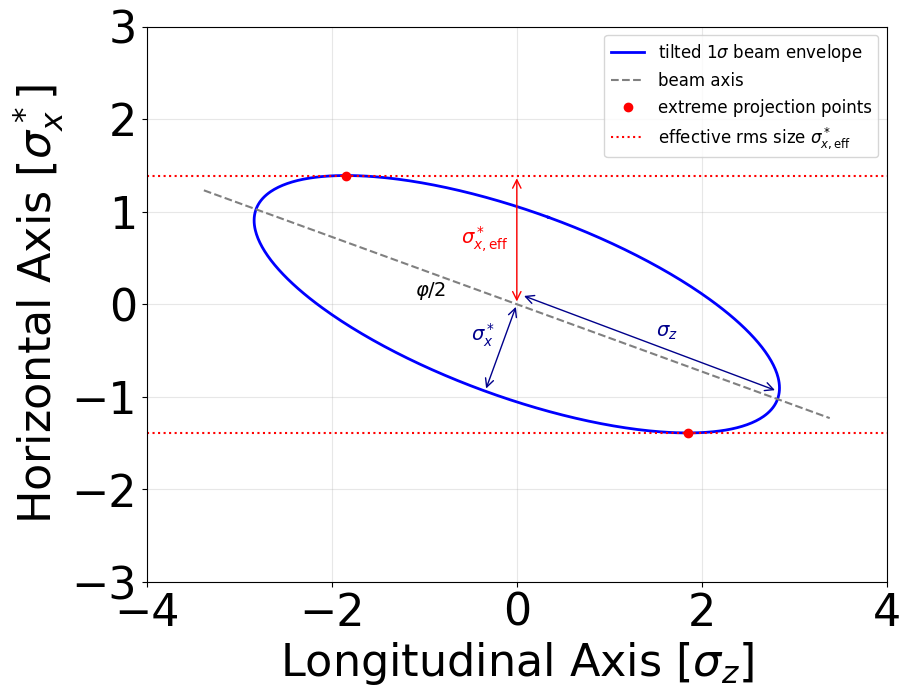
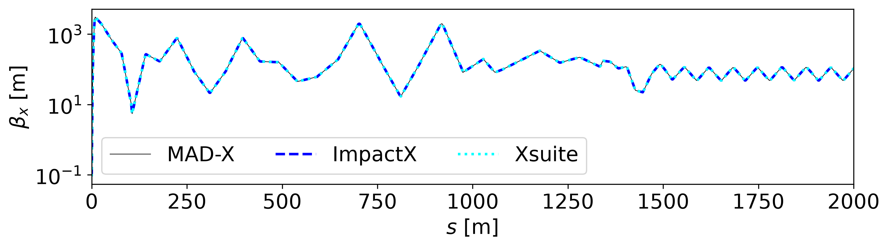
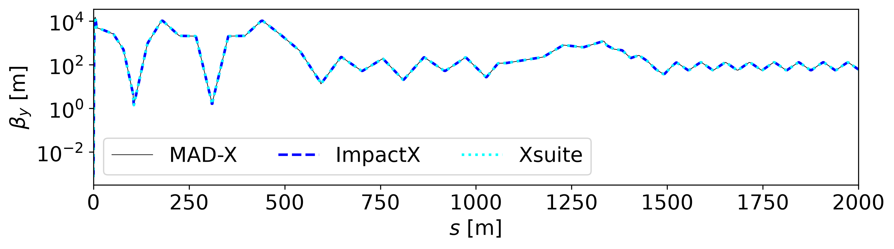
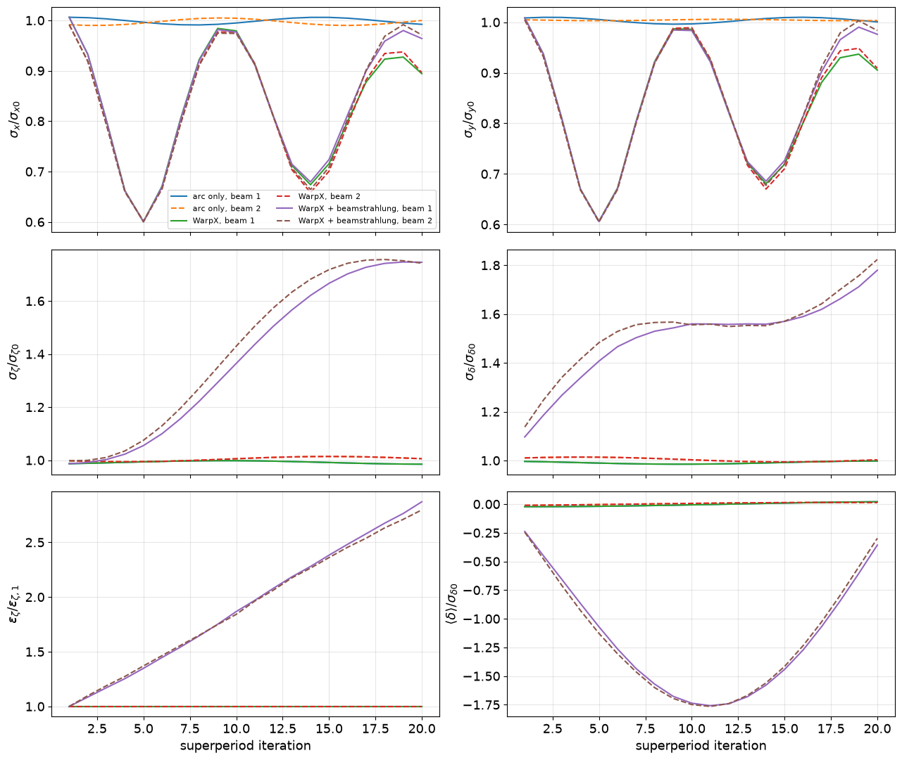

:::::::::::::::::::::::::::::::::::::: questions

- How can WarpX, ImpactX, Xsuite, and MAD-X be combined for FCC-ee studies?
- How closely do ImpactX, Xsuite, and MAD-X agree for linear optics?
- How can a WarpX beam-beam interaction be included in a multi-turn
  simulation with Xsuite?

::::::::::::::::::::::::::::::::::::::::::::::::

::::::::::::::::::::::::::::::::::::: objectives

- Set up the software environment used by all three exercises.
- Simulate one FCC-ee bunch crossing with WarpX.
- Compare linear optics through an FCC-ee lattice with ImpactX, Xsuite, and
  MAD-X.
- Combine a WarpX beam-beam interaction with multi-turn Xsuite tracking.

::::::::::::::::::::::::::::::::::::::::::::::::

## Overview

The three exercises cover different scales of an FCC-ee simulation.

1. **A single bunch crossing.** WarpX models the electromagnetic interaction
   between an electron bunch and a positron bunch, including several QED
   processes such as beamstrahlung, radiative Bhabha scattering, and
   incoherent pair generation.
2. **An optics comparison.** ImpactX, Xsuite, and MAD-X evaluate the same
   linear FCC-ee lattice with a common reference particle; ImpactX transports
   a matched beam covariance through it.
3. **Many turns around the ring.** Xsuite tracks the bunches around the FCC-ee
   lattice and WarpX supplies the beam-beam interaction at the collision point.

All three exercises use one Conda environment. Tutorial 1 is designed to run
on a laptop in a few minutes. Its numerical resolution is deliberately modest
and should not be used as a production setup.

## Installation

We assume you have a Conda installation available in your machine.
Download the [Conda environment file](./files/us-fcc-2026/environment_setup.yml),
open a terminal in the directory containing it, and create the environment:

```bash
conda env create -f environment_setup.yml
```

Activate it with:

```bash
conda activate usfcc26-warpx-tutorial
```

The environment contains WarpX, ImpactX, Xsuite, MAD-X through CPyMAD,
openPMD-viewer, Jupyter, and the Python packages used by the analysis
notebooks.

:::::::::::::::::::::::::::::::::::::::::: spoiler

### View the environment file


``` output
name: usfcc26-warpx-tutorial
channels:
  - conda-forge
dependencies:
  - python=3.11
  - warpx
  - impactx
  - openmpi
  - numpy
  - pandas
  - matplotlib
  - jupyterlab
  - openpmd-viewer
  - pip
  - pip:
      - xsuite
      - cpymad
      - numba
```

::::::::::::::::::::::::::::::::::::::::::::::::::

You can use any notebook interface. For example, start Jupyter Lab from the
exercise directory with:

```bash
jupyter lab
```

When you have finished working, deactivate the environment:

```bash
conda deactivate
```

To remove it completely at a later date, run:

```bash
conda env remove -n usfcc26-warpx-tutorial
```

## Tutorial 1: One FCC-ee bunch crossing with WarpX

### What we will simulate

At the FCC-ee Z pole, a 45.6 GeV electron bunch collides with a 45.6 GeV
positron bunch at a full crossing angle of 30 mrad. The bunches are flat, with
an rms size of about 8 micrometers horizontally and 35 nanometers vertically
at the interaction point. The bunches are 16 mm long.

WarpX computes the beam-beam fields and advances both bunches through the
collision. The same simulation also generates beamstrahlung photons,
radiative Bhabha photons, and incoherent electron-positron pairs.

### Download the files

Create a directory for Tutorial 1 and place all of the following files in it:

- [WarpX input file](./files/us-fcc-2026/tutorial_1/tutorial_1_input.txt)
- [Analysis notebook](./files/us-fcc-2026/tutorial_1/tutorial_1_plots.ipynb)
- [Analysis utility module](./files/us-fcc-2026/tutorial_1/tutorial_1_utils.py)

The notebook and utility module must remain in the same directory as the
input file.

### Read the input file

The [input file](./files/us-fcc-2026/tutorial_1/tutorial_1_input.txt) is
split into constants, numerical settings, particle species, collision
processes, and diagnostics. Values defined under `my_constants` can be reused
throughout the rest of the file.

:::::::::::::::::::::::::::::::::::::::::: spoiler

### View the WarpX input file


``` output
####################
### MY CONSTANTS ###
####################
my_constants.mc2   = m_e*clight*clight
my_constants.GeV   = q_e*1.e9
my_constants.pico  = 1.e-12
my_constants.nano  = 1.e-9
my_constants.micro = 1.e-6
my_constants.milli = 1.e-3

# BEAMS
my_constants.energy         = 45.6*GeV
my_constants.energy_eV      = energy / q_e
my_constants.gamma          = energy / mc2
my_constants.npart          = 20.20e10
my_constants.nmacropart     = 1e5
my_constants.charge         = q_e * npart
my_constants.betax          = 90*milli
my_constants.betay          = 0.7*milli
my_constants.sigmax         = 7993.75*nano
my_constants.sigmay         = 35.20*nano
my_constants.emitx          = sigmax*sigmax / betax
my_constants.emity          = sigmay*sigmay / betay
my_constants.emitx_n        = emitx * gamma
my_constants.emity_n        = emity * gamma
my_constants.sigmaz         = 16.7*milli
my_constants.dux            = emitx_n / sigmax
my_constants.duy            = emity_n / sigmay
my_constants.espread        = 1.34e-3 * gamma
my_constants.mux            = 0.0*sigmax
my_constants.muy            = 0.0*sigmay
my_constants.muz            = 0.25*Lz
my_constants.focal_distance = muz
my_constants.crossing_angle = 30e-3
my_constants.rotation_angle = 0.5*crossing_angle
my_constants.sigmax_init    = sigmax*sqrt(1 + (muz/betax)**2)
my_constants.sigmay_init    = sigmay*sqrt(1 + (muz/betay)**2)

# BOX
my_constants.Lx = 8*( sigmax_init*cos(rotation_angle) + sigmaz*sin(rotation_angle) )
my_constants.Ly = 8*sigmay_init
my_constants.Lz = 16*sigmaz*cos(rotation_angle)
my_constants.nx = 64    # 512
my_constants.ny = 64    # 2048
my_constants.nz = 128   # 512
my_constants.dx = Lx/nx
my_constants.dy = Ly/ny
my_constants.dz = Lz/nz

# TIME
my_constants.T = 0.5*Lz/clight
my_constants.dt = T / nz
my_constants.nt = floor(T/dt)

# VIRTUAL PHOTONS
# minimum energy
my_constants.hwmin = 1e-4 * mc2 * mc2 / energy

# COLLISIONS
my_constants.sigma_kn_max = 6.65e-29 # m^2, maximum total Compton cross section (Klein-Nishina)
my_constants.sigma_bw_max = 1.7e-29 # m^2, maximum total Breit-Wheeler  cross section
my_constants.probability_estimate =   npart / nmacropart * sigma_bw_max * 2 * clight * dt  / (dx * dy * dz)
my_constants.probability_target_value = 0.01 # we want the event to have this probability
my_constants.multiplier_bw = probability_target_value / probability_estimate
my_constants.probability_threshold = 0.1
my_constants.multiplier_kn = sigma_kn_max / sigma_bw_max  * multiplier_bw

# DIAGNOSTICS
my_constants.bin_num_1d = 512
my_constants.bin_center_min_1d = 0.
my_constants.bin_center_max_1d = 2.1*energy_eV
my_constants.bin_size_1d = (bin_center_max_1d - bin_center_min_1d) / bin_num_1d
my_constants.bin_edge_min_1d = bin_center_min_1d - 0.5 * bin_size_1d
my_constants.bin_edge_max_1d = bin_center_max_1d + 0.5 * bin_size_1d
my_constants.bin_num_1d_eff = bin_num_1d + 1
warpx.used_inputs_file = warpx_used_inputs.txt

##########################
### GENERAL PARAMETERS ###
##########################
stop_time = T
amr.n_cell = nx ny nz
amr.max_level = 0
geometry.dims = 3
geometry.prob_lo = -0.5*Lx -0.5*Ly -0.5*Lz
geometry.prob_hi =  0.5*Lx  0.5*Ly  0.5*Lz

###########################
### BOUNDARY CONDITIONS ###
###########################
boundary.field_lo = open open open
boundary.field_hi = open open open
boundary.particle_lo = Absorbing Absorbing Absorbing
boundary.particle_hi = Absorbing Absorbing Absorbing

################
### NUMERICS ###
################
warpx.do_electrostatic = relativistic
warpx.const_dt = dt
warpx.grid_type = collocated
algo.particle_shape = 3
algo.particle_pusher = vay
warpx.poisson_solver = fft
warpx.use_2d_slices_fft_solver = 1
warpx.random_seed = 20260908

#################
### PARTICLES ###
#################
particles.species_names = beam1 beam2 pho1 pho2 ele_bh pos_bh ele_bw pos_bw ele_ll pos_ll vpho1 vpho2 pho1_bha pho2_bha beam1_bha beam2_bha test1 test2

# Beams
beam1.species_type = electron
beam1.injection_style = gaussian_beam
beam1.x_rms = sigmax
beam1.y_rms = sigmay
beam1.z_rms = sigmaz
beam1.x_m = - mux
beam1.y_m = - muy
beam1.z_m = - muz
beam1.npart = nmacropart
beam1.q_tot = -charge
beam1.focal_distance = focal_distance
beam1.do_gaussian_beam_rotation = 1
beam1.do_gaussian_beam_rotation_momenta = 0
beam1.gaussian_beam_rotation_angle = rotation_angle
beam1.gaussian_beam_rotation_axis = 0 1 0
beam1.momentum_distribution_type = gaussian
beam1.uz_m = gamma
beam1.uy_m = 0.0
beam1.ux_m = 0.0
beam1.ux_th = dux
beam1.uy_th = duy
beam1.uz_th = espread
beam1.initialize_self_fields = 1
beam1.do_qed_quantum_sync = 1 # BS
beam1.qed_quantum_sync_phot_product_species = pho1
beam1.do_classical_radiation_reaction = 0
beam1.do_qed_virtual_photons = 1
beam1.qed_virtual_photons_do_beam_size_effect = 1
beam1.qed_virtual_photon_species_name = vpho1

beam2.species_type = positron
beam2.injection_style = gaussian_beam
beam2.x_rms = sigmax
beam2.y_rms = sigmay
beam2.z_rms = sigmaz
beam2.x_m = mux
beam2.y_m = muy
beam2.z_m = muz
beam2.npart = nmacropart
beam2.q_tot = charge
beam2.focal_distance = focal_distance
beam2.do_gaussian_beam_rotation = 1
beam2.do_gaussian_beam_rotation_momenta = 0
beam2.gaussian_beam_rotation_angle = -rotation_angle
beam2.gaussian_beam_rotation_axis = 0 1 0
beam2.momentum_distribution_type = gaussian
beam2.uz_m = -gamma
beam2.uy_m = 0.0
beam2.ux_m = 0.0
beam2.ux_th = dux
beam2.uy_th = duy
beam2.uz_th = espread
beam2.initialize_self_fields = 1
beam2.do_qed_quantum_sync = 1
beam2.qed_quantum_sync_phot_product_species = pho2
beam2.do_classical_radiation_reaction = 0
beam2.do_qed_virtual_photons = 1
beam2.qed_virtual_photons_do_beam_size_effect = 1
beam2.qed_virtual_photon_species_name = vpho2

# Test particles
test1.species_type = electron
test1.injection_style = gaussian_beam
test1.x_rms = sigmax
test1.y_rms = sigmay
test1.z_rms = sigmaz
test1.x_m = - mux
test1.y_m = - muy
test1.z_m = - muz
test1.npart = 100
test1.q_tot = -charge
test1.focal_distance = focal_distance
test1.do_gaussian_beam_rotation = 1
test1.do_gaussian_beam_rotation_momenta = 0
test1.gaussian_beam_rotation_angle = rotation_angle
test1.gaussian_beam_rotation_axis = 0 1 0
test1.momentum_distribution_type = gaussian
test1.uz_m = gamma
test1.uy_m = 0.0
test1.ux_m = 0.0
test1.ux_th = dux
test1.uy_th = duy
test1.uz_th = espread
test1.do_not_deposit = 1

test2.species_type = positron
test2.injection_style = gaussian_beam
test2.x_rms = sigmax
test2.y_rms = sigmay
test2.z_rms = sigmaz
test2.x_m = mux
test2.y_m = muy
test2.z_m = muz
test2.npart = 100
test2.q_tot = charge
test2.focal_distance = focal_distance
test2.do_gaussian_beam_rotation = 1
test2.do_gaussian_beam_rotation_momenta = 0
test2.gaussian_beam_rotation_angle = -rotation_angle
test2.gaussian_beam_rotation_axis = 0 1 0
test2.momentum_distribution_type = gaussian
test2.uz_m = -gamma
test2.uy_m = 0.0
test2.ux_m = 0.0
test2.ux_th = dux
test2.uy_th = duy
test2.uz_th = espread
test2.do_not_deposit = 1

# Beamstrahlung photons
pho1.species_type = photon
pho1.injection_style = none

pho2.species_type = photon
pho2.injection_style = none

# Virtual photons
vpho1.qed_virtual_photons_min_energy = hwmin
vpho1.qed_virtual_photons_multiplier = 1
vpho1.species_type = photon
vpho1.injection_style = none
vpho1.do_not_push = 1

vpho2.qed_virtual_photons_min_energy = hwmin
vpho2.qed_virtual_photons_multiplier = 1
vpho2.species_type = photon
vpho2.injection_style = none
vpho2.do_not_push = 1

# Incoherent pairs
ele_bw.species_type = electron
ele_bw.injection_style = none
ele_bw.do_not_deposit = 1

pos_bw.species_type = positron
pos_bw.injection_style = none
pos_bw.do_not_deposit = 1

ele_ll.species_type = electron
ele_ll.injection_style = none
ele_ll.do_not_deposit = 1

pos_ll.species_type = positron
pos_ll.injection_style = none
pos_ll.do_not_deposit = 1

ele_bh.species_type = electron
ele_bh.injection_style = none
ele_bh.do_not_deposit = 1

pos_bh.species_type = positron
pos_bh.injection_style = none
pos_bh.do_not_deposit = 1

# Bhabha photons
pho1_bha.species_type = photon
pho1_bha.injection_style = none
pho1_bha.do_qed_breit_wheeler = 0

pho2_bha.species_type = photon
pho2_bha.injection_style = none
pho2_bha.do_qed_breit_wheeler = 0

# Backscattered beam particles
beam1_bha.species_type = electron
beam1_bha.injection_style = none
beam1_bha.do_not_deposit = 1

beam2_bha.species_type = positron
beam2_bha.injection_style = none
beam2_bha.do_not_deposit = 1

##############
### SF-QED ###
##############

qed_qs.photon_creation_energy_threshold = 0.

qed_qs.lookup_table_mode = builtin
qed_qs.chi_min = 1.e-8

warpx.do_qed_schwinger = 0.

##################
### COLLISIONS ###
##################
collisions.collision_names = ll bh1 bh2 lbw bhabha1 bhabha2

lbw.species = pho1 pho2
lbw.type = linear_breit_wheeler
lbw.product_species = ele_bw pos_bw
lbw.event_multiplier = multiplier_bw
lbw.probability_threshold = probability_threshold
lbw.probability_target_value = probability_target_value

ll.species = vpho1 vpho2
ll.type = linear_breit_wheeler
ll.product_species = ele_ll pos_ll
ll.event_multiplier = multiplier_bw
ll.probability_threshold = probability_threshold
ll.probability_target_value = probability_target_value

bh1.species = vpho1 pho2
bh1.type = linear_breit_wheeler
bh1.product_species = ele_bh pos_bh
bh1.event_multiplier = multiplier_bw
bh1.probability_threshold = probability_threshold
bh1.probability_target_value = probability_target_value

bh2.species = pho1 vpho2
bh2.type = linear_breit_wheeler
bh2.product_species = ele_bh pos_bh
bh2.event_multiplier = multiplier_bw
bh2.probability_threshold = probability_threshold
bh2.probability_target_value = probability_target_value

bhabha1.species = vpho2 beam1
bhabha1.type = linear_compton
bhabha1.product_species = pho1_bha beam1_bha
bhabha1.event_multiplier = multiplier_kn
bhabha1.probability_threshold = probability_threshold
bhabha1.probability_target_value = probability_target_value

bhabha2.species = vpho1 beam2
bhabha2.type = linear_compton
bhabha2.product_species = pho2_bha beam2_bha
bhabha2.event_multiplier = multiplier_kn
bhabha2.probability_threshold = probability_threshold
bhabha2.probability_target_value = probability_target_value

###################
### DIAGNOSTICS ###
###################
# These will contain per particle coordinates, momenta and weights
diagnostics.diags_names = particles_in particles_out trajectories

trajectories.intervals = 1
trajectories.write_species = 1
trajectories.diag_type = Full
trajectories.species = test1 test2
trajectories.fields_to_plot = none
trajectories.format = openpmd
trajectories.openpmd_backend = bp
trajectories.dump_last_timestep = 1
trajectories.test1.additional_variables = Ex Ey Ez Bx By Bz
trajectories.test2.additional_variables = Ex Ey Ez Bx By Bz

particles_in.intervals = floor(nz/4)
particles_in.write_species = 1
particles_in.diag_type = Full
particles_in.species = beam1 beam2 pho1 pho2 ele_bh pos_bh ele_bw pos_bw ele_ll pos_ll pho1_bha pho2_bha beam1_bha beam2_bha
particles_in.fields_to_plot = none
particles_in.format = openpmd
particles_in.openpmd_backend = bp
particles_in.dump_last_timestep = 1

particles_out.intervals = -1
particles_out.diag_type = BoundaryScraping
particles_out.format = openpmd
particles_out.openpmd_backend = bp
particles_out.dump_last_timestep = 1

beam1.save_particles_at_xlo = 1
beam1.save_particles_at_ylo = 1
beam1.save_particles_at_zlo = 1
beam1.save_particles_at_xhi = 1
beam1.save_particles_at_yhi = 1
beam1.save_particles_at_zhi = 1

beam2.save_particles_at_xlo = 1
beam2.save_particles_at_ylo = 1
beam2.save_particles_at_zlo = 1
beam2.save_particles_at_xhi = 1
beam2.save_particles_at_yhi = 1
beam2.save_particles_at_zhi = 1

pho1.save_particles_at_xlo = 1
pho1.save_particles_at_ylo = 1
pho1.save_particles_at_zlo = 1
pho1.save_particles_at_xhi = 1
pho1.save_particles_at_yhi = 1
pho1.save_particles_at_zhi = 1

pho2.save_particles_at_xlo = 1
pho2.save_particles_at_ylo = 1
pho2.save_particles_at_zlo = 1
pho2.save_particles_at_xhi = 1
pho2.save_particles_at_yhi = 1
pho2.save_particles_at_zhi = 1

ele_ll.save_particles_at_xlo = 1
ele_ll.save_particles_at_ylo = 1
ele_ll.save_particles_at_zlo = 1
ele_ll.save_particles_at_xhi = 1
ele_ll.save_particles_at_yhi = 1
ele_ll.save_particles_at_zhi = 1

pos_ll.save_particles_at_xlo = 1
pos_ll.save_particles_at_ylo = 1
pos_ll.save_particles_at_zlo = 1
pos_ll.save_particles_at_xhi = 1
pos_ll.save_particles_at_yhi = 1
pos_ll.save_particles_at_zhi = 1

ele_bh.save_particles_at_xlo = 1
ele_bh.save_particles_at_ylo = 1
ele_bh.save_particles_at_zlo = 1
ele_bh.save_particles_at_xhi = 1
ele_bh.save_particles_at_yhi = 1
ele_bh.save_particles_at_zhi = 1

pos_bh.save_particles_at_xlo = 1
pos_bh.save_particles_at_ylo = 1
pos_bh.save_particles_at_zlo = 1
pos_bh.save_particles_at_xhi = 1
pos_bh.save_particles_at_yhi = 1
pos_bh.save_particles_at_zhi = 1

ele_bw.save_particles_at_xlo = 1
ele_bw.save_particles_at_ylo = 1
ele_bw.save_particles_at_zlo = 1
ele_bw.save_particles_at_xhi = 1
ele_bw.save_particles_at_yhi = 1
ele_bw.save_particles_at_zhi = 1

pos_bw.save_particles_at_xlo = 1
pos_bw.save_particles_at_ylo = 1
pos_bw.save_particles_at_zlo = 1
pos_bw.save_particles_at_xhi = 1
pos_bw.save_particles_at_yhi = 1
pos_bw.save_particles_at_zhi = 1

pho1_bha.save_particles_at_xlo = 1
pho1_bha.save_particles_at_ylo = 1
pho1_bha.save_particles_at_zlo = 1
pho1_bha.save_particles_at_xhi = 1
pho1_bha.save_particles_at_yhi = 1
pho1_bha.save_particles_at_zhi = 1

pho2_bha.save_particles_at_xlo = 1
pho2_bha.save_particles_at_ylo = 1
pho2_bha.save_particles_at_zlo = 1
pho2_bha.save_particles_at_xhi = 1
pho2_bha.save_particles_at_yhi = 1
pho2_bha.save_particles_at_zhi = 1

beam1_bha.save_particles_at_xlo = 1
beam1_bha.save_particles_at_ylo = 1
beam1_bha.save_particles_at_zlo = 1
beam1_bha.save_particles_at_xhi = 1
beam1_bha.save_particles_at_yhi = 1
beam1_bha.save_particles_at_zhi = 1

beam2_bha.save_particles_at_xlo = 1
beam2_bha.save_particles_at_ylo = 1
beam2_bha.save_particles_at_zlo = 1
beam2_bha.save_particles_at_xhi = 1
beam2_bha.save_particles_at_yhi = 1
beam2_bha.save_particles_at_zhi = 1

# REDUCED
warpx.reduced_diags_names = DiffLumi_beam1_beam2 ColliderRelevant

DiffLumi_beam1_beam2.type = DifferentialLuminosity
DiffLumi_beam1_beam2.intervals = nt
DiffLumi_beam1_beam2.species = beam1 beam2
DiffLumi_beam1_beam2.bin_number = bin_num_1d_eff
DiffLumi_beam1_beam2.bin_max = bin_edge_max_1d
DiffLumi_beam1_beam2.bin_min = bin_edge_min_1d

ColliderRelevant.species = beam1 beam2
ColliderRelevant.type = ColliderRelevant
```

::::::::::::::::::::::::::::::::::::::::::::::::::

The laptop setup uses:

- `100000` macroparticles in each primary bunch
- `100` passive test particles for each beam
- a `64 x 64 x 128` mesh
- `128` time steps
- a two-dimensional-slices FFT Poisson solver
- the built-in quantum-synchrotron lookup table
- a fixed random seed for reproducibility

The mesh is much coarser than a production FCC-ee simulation. It is sufficient
for learning the workflow and recovering the main features of the collision.
The built-in QED table also keeps the download small but has low resolution.
A quantitative physics study would require a higher-resolution QED table,
together with mesh and macroparticle convergence scans.

The primary species and their main products are:

| Species | Role |
|:---|:---|
| `beam1`, `beam2` | Initial electron and positron bunches |
| `test1`, `test2` | Passive electron and positron probes used for trajectories |
| `pho1`, `pho2` | Beamstrahlung photons emitted by the two bunches |
| `vpho1`, `vpho2` | Virtual photons used by the equivalent-photon model |
| `ele_ll`, `pos_ll` | Landau-Lifshitz pair products |
| `ele_bh`, `pos_bh` | Breit-Heitler pair products |
| `ele_bw`, `pos_bw` | Breit-Wheeler pair products |
| `pho1_bha`, `pho2_bha` | Photons from radiative Bhabha scattering |
| `beam1_bha`, `beam2_bha` | Scattered primary particles from Bhabha events |

Beamstrahlung is enabled directly on each primary beam through the
strong-field QED modules.
The incoherent-pair and radiative Bhabha channels are listed in
`collisions.collision_names`.
Event multipliers increase the number of sampled rare events, while particle
weights preserve the physical yield.

Notice that the radiative Bhabha products are stored in new species. This
makes the emitted photons and scattered primary particles easy to analyze
without mixing them into the original bunch species.

### Diagnostics

The simulation writes three openPMD particle diagnostics:

- `diags/particles_in` contains snapshots of particles that are still inside
  the simulation domain
- `diags/particles_out` records particles when they cross a domain boundary
- `diags/trajectories` records the two test-particle species at every time
  step

The test species start with the same distributions as the primary beams, but
`do_not_deposit = 1` prevents their charge and current from contributing to
the field solve. They respond to the self-consistent beam-beam fields without
changing those fields, making them useful single-particle probes.

The `ColliderRelevant` and `DifferentialLuminosity` reduced diagnostics are
written to `diags/reducedfiles`.

The analysis utility module combines the particles that remain in the box
with the boundary records. For escaped particles, it reconstructs their
positions at the final simulation time from their scrape time and momentum:

$$
\boldsymbol{x}(t_{\mathrm{final}})
=\boldsymbol{x}(t_{\mathrm{scrape}})
+\boldsymbol{v}\left(t_{\mathrm{final}}-t_{\mathrm{scrape}}\right).
$$

For photons, $\boldsymbol{v}=c\boldsymbol{p}/|\boldsymbol{p}|$. For massive
particles, the utility obtains the velocity from
$\boldsymbol{v}=\boldsymbol{p}/(\gamma m_e)$. This reconstruction lets the
later spectrum and pair plots include products that have already left the
mesh instead of silently discarding them.

### Run WarpX

Activate the tutorial environment, change to the directory containing the
three downloaded files, and run:

```bash
conda activate usfcc26-warpx-tutorial
warpx.3d tutorial_1_input.txt
```

On the laptop used to prepare this tutorial, the run takes about three to four
minutes and produces roughly 80 MB of diagnostics. Runtime will vary with the
processor and storage system.

When the run finishes, your directory should contain:

```text
tutorial_1_input.txt
tutorial_1_plots.ipynb
tutorial_1_utils.py
diags/
warpx_used_inputs.txt
```

`warpx_used_inputs.txt` is generated by WarpX. It records the fully evaluated
input and is useful when an input value is defined through an expression.

### Analyze the collision

Open [the analysis notebook](./files/us-fcc-2026/tutorial_1/tutorial_1_plots.ipynb)
with your preferred Jupyter interface and run the cells in order. The notebook
expects the `diags` directory in the current Tutorial 1 directory.

:::::::::::::::::::::::::::::::::::::::::: spoiler

### View the analysis notebook

<iframe
  src="https://nbviewer.org/github/BLAST-WarpX/warpx-tutorials/blob/main/episodes/files/us-fcc-2026/tutorial_1/tutorial_1_plots.ipynb"
  width="100%"
  height="800"
  style="border: none"
  loading="lazy">
</iframe>

::::::::::::::::::::::::::::::::::::::::::::::::::

The [utility module](./files/us-fcc-2026/tutorial_1/tutorial_1_utils.py)
contains the routines used to read particle data, reconstruct boundary
particles, integrate the hourglass luminosity, and calculate the radiative
Bhabha cross section and lifetime.

:::::::::::::::::::::::::::::::::::::::::: spoiler

### View the analysis utility module


``` output
import os
import re
import warnings

import numpy as np
from openpmd_viewer import OpenPMDTimeSeries
from scipy.constants import c, e, m_e
from scipy.integrate import quad, trapezoid


def extract_macroparticles(species_list, sim_folder=".", diags_name="diags", step=-1):
    """
    Read WarpX coordinates located at 'sim_folder' in 'diags_name'
    corresponding to simulation timestep 'step'.
    """
    x_list = []
    y_list = []
    z_list = []
    w_list = []
    ux_list = []
    uy_list = []
    uz_list = []

    if step==-1:
        folder_list = [
            diags_name+'/particles_in',
            diags_name+'/particles_out/particles_at_xlo',
            diags_name+'/particles_out/particles_at_xhi',
            diags_name+'/particles_out/particles_at_ylo',
            diags_name+'/particles_out/particles_at_yhi',
            diags_name+'/particles_out/particles_at_zlo',
            diags_name+'/particles_out/particles_at_zhi',
            ]
    else:
        folder_list = [ diags_name+'/particles_in', ]
    # Loop through the files that contain particles collected at the edges and in the box
    for folder_name in folder_list:
        read_dir = os.path.join(sim_folder, folder_name)
        if os.path.isdir(read_dir):
            series = OpenPMDTimeSeries(read_dir)
            time = series.t[step]
            iteration = series.iterations[step]
            dt =  series.t[-1] / series.iterations[-1]

            for species in species_list:
                x, y, z, ux, uy, uz, w = series.get_particle( ['x', 'y', 'z', 'ux', 'uy', 'uz', 'w'], iteration=iteration, species=species )

                if ("particles_at" in folder_name):
                    it_scrape, = series.get_particle( ['stepScraped', ], iteration=iteration, species=species )
                    t_scrape = it_scrape * dt

                    momentum_squared = ux**2 + uy**2 + uz**2
                    if "pho" in species:
                        momentum_magnitude = np.sqrt(momentum_squared)
                        vx = c * ux / momentum_magnitude
                        vy = c * uy / momentum_magnitude
                        vz = c * uz / momentum_magnitude
                    else:
                        gamma = np.sqrt(1.0 + momentum_squared / (m_e * c) ** 2)
                        vx = ux / (gamma * m_e)
                        vy = uy / (gamma * m_e)
                        vz = uz / (gamma * m_e)

                    time_since_scrape = time - t_scrape
                    x = x + vx * time_since_scrape
                    y = y + vy * time_since_scrape
                    z = z + vz * time_since_scrape

                # convert from SI [kg m s-1] to [eV/c]
                conversion_factor = c/e

                x_list=np.append(x_list, x)
                y_list=np.append(y_list, y)
                z_list=np.append(z_list, z)
                w_list=np.append(w_list, w)
                ux_list=np.append(ux_list, ux * conversion_factor)
                uy_list=np.append(uy_list, uy * conversion_factor)
                uz_list=np.append(uz_list, uz * conversion_factor)

    # x y z [m], ux, uy, uz [eV/c], w=weight (no dimension)
    return np.asarray(x_list), np.asarray(y_list), np.asarray(z_list), np.asarray(ux_list), np.asarray(uy_list), np.asarray(uz_list), np.asarray(w_list)

def get_Ecom(filename):
    """
    Return 1 numpy array:
    - the center-of-mass energy (in eV)
    """
    with open(filename) as f:
        # First line: header, contains the energies
        line = f.readline()
        Ecom = np.array( list(map( float, re.findall('=(.*?)\\(', line) )) )
    return Ecom

def get_dL_dEcom(filename):
    """
    Return the cumulative differential luminosity and its energy integral.

    Returns:
    - the center-of-mass energy [eV]
    - differential luminosity [m^-2 eV^-1]
    - luminosity integrated over center-of-mass energy [m^-2]
    """
    Ecom = get_Ecom(filename)  # eV
    # ``ndmin=2`` also handles a diagnostic containing only its final row.
    values = np.loadtxt(filename, ndmin=2)[-1, 2:]
    if values.size == Ecom.size + 1:
        # Current WarpX appends the total luminosity after the differential
        # energy bins. Keep it out of the plotted spectrum.
        dL_dEcom = values[:-1]  # m^-2 eV^-1
        Ltot = values[-1]  # m^-2
    elif values.size == Ecom.size:
        # Compatibility with older output that omitted the total column.
        warnings.warn(
            "DifferentialLuminosity has no final total-luminosity column; "
            "integrating the energy bins. Check the WarpX version.",
            RuntimeWarning,
            stacklevel=2,
        )
        dL_dEcom = values
        Ltot = trapezoid(dL_dEcom, Ecom)
    else:
        raise ValueError(
            "Unexpected DifferentialLuminosity layout: "
            f"found {values.size} values for {Ecom.size} energy bins"
        )

    return Ecom, dL_dEcom, Ltot


def luminosity_per_bx_hourglass(
    bunch_intensity,
    sigma_x,
    sigma_y,
    sigma_z,
    phi,
    beta_x_star,
    beta_y_star,
    epsabs=0.0,
    epsrel=1.0e-10,
):
    """Return luminosity per bunch crossing, including the hourglass effect.

    This evaluates the longitudinal overlap of two identical Gaussian bunches.
    The transverse beam sizes evolve around the interaction-point waist as
    ``sigma(s) = sigma_star * sqrt(1 + (s / beta_star)**2)``. The crossing
    angle ``phi`` is the half crossing angle.

    Parameters are in SI units (meters and radians); the returned luminosity
    per bunch crossing is in ``m^-2``.
    """
    positive_parameters = {
        "bunch_intensity": bunch_intensity,
        "sigma_x": sigma_x,
        "sigma_y": sigma_y,
        "sigma_z": sigma_z,
        "beta_x_star": beta_x_star,
        "beta_y_star": beta_y_star,
    }
    for name, value in positive_parameters.items():
        if value <= 0.0:
            raise ValueError(f"{name} must be positive, got {value!r}")

    def integrand(s):
        sigma_x_s = sigma_x * np.sqrt(1.0 + (s / beta_x_star) ** 2)
        sigma_y_s = sigma_y * np.sqrt(1.0 + (s / beta_y_star) ** 2)
        longitudinal_overlap = np.exp(-(s / sigma_z) ** 2)
        crossing_angle_reduction = np.exp(-((phi * s) / sigma_x_s) ** 2)
        return longitudinal_overlap * crossing_angle_reduction / (
            sigma_x_s * sigma_y_s
        )

    overlap_integral, _ = quad(
        integrand,
        -np.inf,
        np.inf,
        epsabs=epsabs,
        epsrel=epsrel,
        limit=200,
    )
    normalization = 4.0 * np.pi * np.sqrt(np.pi) * sigma_z
    return bunch_intensity**2 * overlap_integral / normalization


def integrand_qed(y, beam_energy, electron_mass):
    """Return the radiative-Bhabha cross-section integrand.

    ``y`` is the emitted photon's fractional beam energy. ``beam_energy`` and
    ``electron_mass`` must use the same energy unit; the tutorial uses GeV.
    This expression neglects the beam-size effect.
    """
    if not 0.0 < y < 1.0:
        raise ValueError(f"y must lie strictly between 0 and 1, got {y!r}")
    if beam_energy <= 0.0 or electron_mass <= 0.0:
        raise ValueError("beam_energy and electron_mass must be positive")

    photon_spectrum = (4.0 / 3.0 + y**2 - 4.0 * y / 3.0) / y
    logarithmic_factor = (
        2.0 * np.log(4.0 * beam_energy**2 / electron_mass**2)
        + 2.0 * np.log((1.0 - y) / y)
        - 1.0
    )
    return photon_spectrum * logarithmic_factor


def beam_lifetime(
    cross_section,
    luminosity_per_bx,
    bunch_population,
    n_interaction_points,
    revolution_frequency,
    n_bunches=1,
):
    """Return the beam lifetime in hours.

    ``cross_section * luminosity_per_bx`` must be dimensionless. For example,
    use a cross section in mbarn with luminosity converted to mbarn^-1 per
    bunch crossing, as done in the tutorial notebook.
    """
    positive_parameters = {
        "cross_section": cross_section,
        "luminosity_per_bx": luminosity_per_bx,
        "bunch_population": bunch_population,
        "n_interaction_points": n_interaction_points,
        "revolution_frequency": revolution_frequency,
        "n_bunches": n_bunches,
    }
    for name, value in positive_parameters.items():
        if value <= 0.0:
            raise ValueError(f"{name} must be positive, got {value!r}")

    loss_rate = (
        cross_section
        * luminosity_per_bx
        * n_interaction_points
        * revolution_frequency
        * n_bunches
    )
    return bunch_population / loss_rate / 3600.0
```

::::::::::::::::::::::::::::::::::::::::::::::::::

### What the notebook checks

The notebook does more than plot the output. It turns the particle and reduced
diagnostics into beam-physics quantities and, where a compact analytical model
is available, compares the simulation with that model. The seven stages below
explain what is calculated and what each comparison can tell us.

#### 1. Derived beam parameters

The notebook first reproduces the quantities needed by the later estimates.
The relativistic factor and the rms angular divergences at the interaction
point are

$$
\gamma=\frac{E_{\mathrm{beam}}}{m_ec^2},
\qquad
\sigma_{x'}^*=\frac{\sigma_x^*}{\beta_x^*},
\qquad
\sigma_{y'}^*=\frac{\sigma_y^*}{\beta_y^*}.
$$

The 30 mrad value in the input is the *full* crossing angle, so the formulae
use the half angle $\phi=15$ mrad. The Piwinski angle and the corresponding
effective horizontal overlap size are

$$
\Phi=\frac{\sigma_z}{\sigma_x^*}\tan\phi,
\qquad
\sigma_{x,\mathrm{eff}}^*=\sigma_x^*\sqrt{1+\Phi^2}.
$$

For the supplied parameters, $\Phi\simeq31.34$: the crossing angle therefore
dominates the effective horizontal overlap.



The notebook evaluates the linearized beam-beam parameters

$$
\xi_x=\frac{N_b r_e\beta_x^*}
{2\pi\gamma\sigma_{x,\mathrm{eff}}^*
\left(\sigma_{x,\mathrm{eff}}^*+\sigma_y^*\right)},
$$

$$
\xi_y=\frac{N_b r_e\beta_y^*}
{2\pi\gamma\sigma_y^*
\left(\sigma_{x,\mathrm{eff}}^*+\sigma_y^*\right)},
$$

where $N_b$ is the bunch population and $r_e$ is the classical electron
radius. The resulting values are approximately $\xi_x=0.0015$ and
$\xi_y=0.0805$.

#### 2. Collision snapshots

At each stored iteration, the notebook plots both primary beams and their
beamstrahlung photons in the $(z,x)$ and $(z,y)$ planes. Coordinates are
normalized as $z/\sigma_z$, $x/\sigma_x^*$, and $y/\sigma_y^*$ so that the
very different horizontal, vertical, and longitudinal scales can be compared
in the same figure. These views check the crossing geometry and direction of
motion: beam 1 travels toward positive $z$, beam 2 toward negative $z$, and
the photon products follow the parent beams. Plotting uses a stride for speed;
the underlying diagnostic data are not down-sampled.

The notebook next creates one `ParticleTracker` for `test1` and another for
`test2`. Both trackers select their particles at the first trajectory output.
With `preserve_particle_index=True`, a given particle ID retains the same
array index at every later iteration; if a particle is absent, its entry is
filled with `NaN` instead of shifting all subsequent trajectories. Plotting
each column of the coordinate arrays therefore traces one physical particle
through the collision. The 3D view shows the full $(z,x,y)$ paths, while the
$(z,x)$ and $(z,y)$ projections make the small transverse motion easier to
read. These passive trajectories reveal the crossing geometry and accumulated
beam-beam deflection without the sampling noise of the full bunches.

#### 3. Horizontal beam-beam kick

To measure the kick, the notebook selects the beam-1 macroparticles present in
the final diagnostic and uses their unique particle IDs to retrieve those same
particles from the initial diagnostic. This avoids pairing unrelated rows if
the openPMD particle order changes. It then converts momenta into
ultrarelativistic trajectory angles,

$$
x'=\frac{p_x}{p_z},
\qquad
\Delta x'=x'_{\mathrm{end}}-x'_{\mathrm{start}}.
$$

Close to the opposing bunch axis, a Gaussian beam acts like a linear focusing
lens:

$$
\Delta x'(x)\simeq-\frac{4\pi\xi_x}{\beta_x^*}x.
$$

Because $\sigma_{x'}^*=\sigma_x^*/\beta_x^*$, normalizing both axes gives a
particularly direct test,

$$
\frac{\Delta x'}{\sigma_{x'}^*}
\simeq -4\pi\xi_x\frac{x}{\sigma_x^*}.
$$

The notebook fits a straight line over $|x|<10\sigma_x^*$. This wide-looking
interval still samples the central part of the force because
$\sigma_{x,\mathrm{eff}}^*\gg\sigma_x^*$ for this crossing angle. With the
supplied laptop input, the fitted normalized slope is about `-0.0171`, while
the analytical slope $-4\pi\xi_x$ is about `-0.0183`, a difference of roughly
7 percent. This tests the combined field solve and particle push at the chosen
resolution. It is not a convergence test, and it considers only particles
that remain in the domain through the final recorded iteration.

#### 4. Photon spectra and the loss threshold

The helper combines photons still inside the domain with photons found in the
boundary-scraping diagnostics. Since openPMD returns momentum in this analysis
as eV/$c$, the photon energy in GeV is calculated from

$$
E_\gamma[\mathrm{GeV}]
=10^{-9}\sqrt{p_x^2+p_y^2+p_z^2}.
$$

The beamstrahlung and radiative Bhabha histograms are weighted histograms. In
an energy bin $j$, the physical photon yield is

$$
N_{\gamma,j}=\sum_{i\in j}w_i,
$$

not the number of macroparticle records. This distinction matters because the
rare-event multipliers deliberately create extra sampled events and compensate
through the macroparticle weights $w_i$.

For the Bhabha spectrum, the notebook also marks the energy associated with a
1 percent ring momentum acceptance. If
$\delta_{\mathrm{acc}}=0.01$, a photon is counted as causing the loss of its
emitting primary when

$$
E_\gamma>\delta_{\mathrm{acc}}E_{\mathrm{beam}}.
$$

This is an approximate loss model: the actual ring acceptance depends on the
lattice and on where the off-momentum particle travels.

#### 5. Luminosity and the hourglass effect

The `DifferentialLuminosity` diagnostic supplies the cumulative
center-of-mass-energy spectrum $d\mathcal{L}/dE_{\mathrm{com}}$, in
m$^{-2}$ eV$^{-1}$. In current WarpX output, the last value on each data row
is the total luminosity per bunch crossing,

$$
\mathcal{L}_{E}=\mathcal{L}_{\mathrm{total}}.
$$

The utility separates that last value from the preceding energy bins before
plotting. For compatibility with an older output layout that omitted the
total, it emits a warning and evaluates the numerical energy integral

$$
\mathcal{L}_{E}
\simeq\sum_j
\left.\frac{d\mathcal{L}}{dE_{\mathrm{com}}}\right|_j\Delta E_j.
$$

The `ColliderRelevant` diagnostic supplies $d\mathcal{L}/dt$, which gives an
independent estimate through a trapezoidal time integral,

$$
\mathcal{L}_{\mathrm{WarpX}}
\simeq\sum_k\frac{1}{2}
\left[
\left.\frac{d\mathcal{L}}{dt}\right|_k+
\left.\frac{d\mathcal{L}}{dt}\right|_{k+1}
\right](t_{k+1}-t_k).
$$

Comparing $\mathcal{L}_{E}$ with $\mathcal{L}_{\mathrm{WarpX}}$ first checks
the consistency of the two WarpX diagnostics. Their energy and time binning
are different, so they are not expected to be bitwise identical; a material
difference should prompt checks of the diagnostic binning and numerical
resolution.

The first analytical estimate treats the transverse sizes as constant and
accounts for the crossing angle only through the effective horizontal size:

$$
\mathcal{L}_0
=\frac{N_b^2}{4\pi\sigma_{x,\mathrm{eff}}^*\sigma_y^*}.
$$

FCC-ee has a strong hourglass effect because the beta functions, especially
$\beta_y^*$, are short compared with the bunch length. The utility module
therefore also evaluates the longitudinal overlap numerically. At a distance
$s$ from the interaction-point waist,

$$
\sigma_u(s)=\sigma_u^*
\sqrt{1+\left(\frac{s}{\beta_u^*}\right)^2},
\qquad u\in\{x,y\},
$$

and the luminosity model used by the notebook is

$$
\mathcal{L}_{\mathrm{HG}}
=\frac{N_b^2}{4\pi\sqrt{\pi}\sigma_z}
\int_{-\infty}^{\infty}
\frac{
\exp\!\left[-(s/\sigma_z)^2\right]
\exp\!\left[-(\phi s/\sigma_x(s))^2\right]
}{\sigma_x(s)\sigma_y(s)}\,ds.
$$

The two exponential factors describe longitudinal bunch overlap and the
crossing-angle reduction, respectively. The notebook reports
$\mathcal{L}_{\mathrm{WarpX}}$, $\mathcal{L}_0$,
$\mathcal{L}_{\mathrm{HG}}$, and the ratio
$\mathcal{L}_{\mathrm{WarpX}}/\mathcal{L}_{\mathrm{HG}}$. At the deliberately
coarse laptop resolution, a discrepancy should be interpreted as motivation
for mesh, time-step, and macroparticle convergence studies rather than as a
precision prediction.

#### 6. Radiative Bhabha cross section and beam lifetime

For each beam, the weighted number of photons above the momentum-acceptance
threshold is

$$
N_{\mathrm{loss}}=
\sum_{E_{\gamma,i}>\delta_{\mathrm{acc}}E_{\mathrm{beam}}}w_i.
$$

Dividing this yield by the simulated luminosity per crossing gives the WarpX
cross-section estimate,

$$
\sigma_{\mathrm{Bhabha}}^{\mathrm{WarpX}}
=\frac{N_{\mathrm{loss}}}{\mathcal{L}_{\mathrm{WarpX}}}.
$$

The notebook compares it with the following QED estimate without the beam-size
effect. Defining $y=E_\gamma/E_{\mathrm{beam}}$ and
$\delta=\delta_{\mathrm{acc}}$,

$$
\sigma_{\mathrm{Bhabha}}^{\mathrm{QED}}
=\frac{2\alpha^3}{m_e^2}
\int_\delta^1
\frac{4/3+y^2-4y/3}{y}
\left[
2\ln\!\left(\frac{4E_{\mathrm{beam}}^2}{m_e^2}\right)
+2\ln\!\left(\frac{1-y}{y}\right)-1
\right]dy.
$$

Energies and masses are inserted in GeV, and the result in GeV$^{-2}$ is
converted with $1\ \mathrm{GeV}^{-2}=0.389\ \mathrm{mbarn}$. The comparison
isolates, approximately, the influence of the equivalent-photon model and its
beam-size effect; it is also subject to Monte Carlo statistics and the simple
loss criterion above.

Finally, the revolution frequency is $f_{\mathrm{rev}}=c/C$, where $C$ is the
ring circumference. For one bunch, the lifetime inferred from either cross
section is

$$
\tau=\frac{N_b}
{\sigma_{\mathrm{Bhabha}}\mathcal{L}_{\mathrm{bx}}
n_{\mathrm{IP}}f_{\mathrm{rev}}},
$$

with $n_{\mathrm{IP}}=4$ and
$\mathcal{L}_{\mathrm{bx}}=\mathcal{L}_{\mathrm{WarpX}}$. The notebook reports
the electron and positron WarpX estimates and compares the positron result
with the QED estimate.

#### 7. Incoherent-pair distributions

The final stage combines the weights and coordinates of the electrons and
positrons from the Landau-Lifshitz, Breit-Heitler, and Breit-Wheeler channels.
The simulation keeps the colliding beams head-on in momentum space, so the
pair momenta are first rotated into the physical crossing-angle frame. Products
with $p_z>0$ are rotated by $+\phi$ about $y$, and products with $p_z<0$ by
$-\phi$. For each rotated momentum it then calculates the polar angle

$$
\theta=\operatorname{atan2}
\left(\sqrt{p_x^2+p_y^2},p_z\right),
$$

and forms the weighted angular density in bin $j$,

$$
\left.\frac{dN}{d\theta}\right|_j
\simeq\frac{1}{\Delta\theta_j}\sum_{i\in j}w_i.
$$

The accompanying $(z,x)$ and $(x,y)$ projections show where the products are
located at the final reconstructed time. These are useful first views of
potential detector backgrounds, but the three production channels are summed
and no detector geometry or transport through the accelerator magnets is
included.

::::::::::::::::::::::::::::::::::::: callout

The close agreement of one observable does not establish numerical
convergence. Increase the mesh resolution and macroparticle count before
drawing quantitative conclusions from the QED yields or luminosity.

::::::::::::::::::::::::::::::::::::::::::::::::

## Tutorial 2: Linear optics comparison

### What we will compare

This exercise evaluates one turn of the FCC-ee Z-pole `fccee_p_ring` sequence
for a 45.6 GeV electron reference particle with ImpactX, Xsuite, and MAD-X.
Rather than
including beam-beam forces, radiation, or space charge, it isolates the
single-particle linear optics. The main observables are the horizontal and
vertical beta functions, $\beta_x(s)$ and $\beta_y(s)$, evaluated along the
same lattice.

All three calculations start from `fccee_z.madx`. This is important: agreement
would be much less meaningful if the codes read independently maintained
versions of the lattice. Create a Tutorial 2 directory containing:

- [the common FCC-ee MAD-X lattice](./files/us-fcc-2026/tutorial_2/fccee_z.madx)
- [the ImpactX envelope script](./files/us-fcc-2026/tutorial_2/fcc_impactx.py)
- [the Tutorial 2 analysis notebook](./files/us-fcc-2026/tutorial_2/tutorial_2_plots.ipynb)

The notebook runs MAD-X through CPyMAD, imports the live MAD-X sequence into
Xsuite, reads the ImpactX diagnostic, and compares all three results. The first
run saves the converted Xsuite line as `fccee_p_ring.json`; later runs load this
file instead of repeating the conversion. Keep the three supplied files
together and execute them from that directory.

### The matched beam model

At the interaction point, the geometric transverse emittances are constructed
from the nominal rms sizes and beta functions,

$$
\varepsilon_x=\frac{(\sigma_x^*)^2}{\beta_x^*},
\qquad
\varepsilon_y=\frac{(\sigma_y^*)^2}{\beta_y^*}.
$$

For either transverse plane $u$, the matched covariance matrix has the Twiss
form

$$
\Sigma_u=\varepsilon_u
\begin{pmatrix}
\beta_u & -\alpha_u\\
-\alpha_u & \gamma_u
\end{pmatrix},
\qquad
\gamma_u=\frac{1+\alpha_u^2}{\beta_u}.
$$

The dispersive part of the horizontal beam size is included through the MAD-X
dispersion. For an rms relative momentum spread $\sigma_\delta$,

$$
\sigma_x^2=\varepsilon_x\beta_x+(D_x\sigma_\delta)^2.
$$

The script initializes ImpactX with the matched $\beta$, $\alpha$, $D$, and
$D'$ values at the beginning of the sequence. For the longitudinal plane it
uses

$$
\varepsilon_t=\sigma_z\sigma_\delta,
\qquad
\beta_t=\frac{\sigma_z}{\sigma_\delta}.
$$

These definitions ensure that a disagreement later in the ring is testing the
lattice translation and transport maps, rather than an intentionally
mismatched initial beam.

### Run the ImpactX calculation

Activate the common tutorial environment, change to the Tutorial 2 directory,
and run:

```bash
conda activate usfcc26-warpx-tutorial
python fcc_impactx.py
```

The tested script uses envelope tracking by default:

```python
DO_PARTICLE_TRACKING = False
```

ImpactX propagates the covariance matrix instead of sampling it with
macroparticles. This removes Monte Carlo noise from the comparison and is much
faster than tracking the script's configured $10^7$ macroparticles. Space
charge is disabled, the lattice is loaded from `fccee_z.madx` with one slice
per element, and `slice_step_diagnostics = True` records the beam parameters
along the ring.

After a successful run, the file used by the notebook is:

```text
diags/reduced_beam_characteristics.0.0
```

It contains $s$, beam sizes, emittances, Twiss parameters, and dispersions at
the ImpactX diagnostic locations.

### Run the three-code comparison

Open the Tutorial 2 analysis notebook from the same directory and run its cells
in order. The notebook performs the following steps:

1. CPyMAD loads `fccee_z.madx`, selects the `fccee_p_ring` sequence, defines a
   45.6 GeV electron reference beam, and runs MAD-X `TWISS`.
2. If `fccee_p_ring.json` is absent, Xsuite constructs a thick-element `Line`
   from that in-memory MAD-X sequence and saves it. Otherwise, it loads the
   existing line. It then runs a four-dimensional Twiss calculation.
3. Pandas reads the ImpactX reduced diagnostic, and the notebook maps the
   common quantity names—for example, MAD-X `betx`, ImpactX `beta_x`, and
   Xsuite `betx`—onto the same plot.
4. The beta functions are compared over the full 90.6 km ring and over the
   first 2 km, where individual optics features are easier to inspect.

For a beam matrix transported by a linear map $R(s)$,

$$
\Sigma(s)=R(s)\Sigma(0)R(s)^{\mathsf T},
\qquad
\beta_u(s)=\frac{\Sigma_{uu}(s)}{\varepsilon_u}.
$$

This is the quantity produced by the ImpactX envelope calculation and overlaid
with the Twiss functions from the other two codes. Because the codes record
values at different longitudinal locations, any quantitative comparison would
first require an explicit matching or interpolation convention.





The curves from the tested setup overlap closely in both planes. The final
ImpactX beta functions also return to within about 0.1 percent of their
initial values after one turn. Inspect the interaction-region peaks and the
one-turn closure separately: agreement at low-beta locations is a more
sensitive check than agreement in slowly varying sections.

::::::::::::::::::::::::::::::::::::: callout

Small differences can come from element slicing, coordinate conventions, or
the treatment of fringe fields and higher-order terms. This exercise uses
one slice per element and a four-dimensional Xsuite Twiss calculation, so it
checks the selected linear model; it does not establish equivalence for
nonlinear or synchrotron motion.

::::::::::::::::::::::::::::::::::::::::::::::::

## Tutorial 3: Multi-turn WarpX and Xsuite simulation

### What the coupled model does

This exercise connects two deliberately different descriptions of the
collider. Xsuite transports the bunches through a linear map representing one
FCC-ee superperiod, while WarpX resolves the collective electron-positron
collision at the following interaction point. The same macroparticles are
passed back and forth, so the beam-beam kick from one encounter affects every
later encounter.

One iteration follows this sequence:

1. Xsuite advances both bunches through one linear superperiod.
2. The adapter converts the two Xsuite coordinate systems into one laboratory
   frame and writes one openPMD file per bunch.
3. A separate Python process starts WarpX, loads those particles, and advances
   them through a single head-on collision.
4. The adapter combines particles still inside the WarpX box with particles
   recorded at its absorbing boundaries.
5. Particle IDs are matched, the coordinates are converted back, and the
   Xsuite particle arrays are updated.
6. Centroids, rms sizes, covariances, and emittances are recorded before the
   next iteration.

The separation of responsibilities is important. Xsuite does not apply a
second beam-beam kick, and WarpX does not model the 90.6 km arc.

### Download the files

Create a Tutorial 3 directory containing:

- [Coupled simulation driver](./files/us-fcc-2026/tutorial_3/exec_tutorial_3.py)
- [WarpX input template](./files/us-fcc-2026/tutorial_3/tutorial_3_input.txt)
- [Single-collision WarpX launcher](./files/us-fcc-2026/tutorial_3/run_warpx.py)
- [Beam and map configuration](./files/us-fcc-2026/tutorial_3/tutorial_3_config.py)
- [Coupling and analysis utilities](./files/us-fcc-2026/tutorial_3/tutorial_3_utils.py)
- [Analysis notebook](./files/us-fcc-2026/tutorial_3/tutorial_3_plots.ipynb)

Keep the six files together. The driver renders a run-specific WarpX input in
the job directory; it never edits the downloaded template.

### Before running the coupling

Tutorial 3 needs `numpy`, `scipy`, `pandas`, `matplotlib`, `xobjects`,
`xpart`, `xtrack`, `openpmd-api`, `openpmd-viewer`, and a Python WarpX build
with openPMD, FFT, and QED support. The QED capability is only exercised by
the `--beamstrahlung` case, but the supplied input declares the photon product
species and quantum-synchrotron table.

Run the driver from the directory containing the six downloaded files. You
can inspect all command-line options with

```bash
python exec_tutorial_3.py --help
```

The `--device gpu` option selects an Xsuite `ContextCupy`; WarpX itself uses
the backend of the installed WarpX package. The default direct launcher and
one rank are intentional. The current adapter can only audit its fallback
particle-ID mapping in a single-rank collision.

### Simplified FCC-ee model

The reference momentum is 182.5 GeV/$c$, corresponding to the FCC-ee ttbar
working point. For an IP with $alpha=0$, the initialized Gaussian widths are

$$
\sigma_x=\sqrt{\varepsilon_x\beta_x},
\qquad
\sigma_{p_x}=\sqrt{\frac{\varepsilon_x}{\beta_x}},
$$

and likewise in $y$. The exercise sets
$\varepsilon_x=\varepsilon_y=1.59\,\mathrm{nm}$ and
$\beta_x=\beta_y=1\,\mathrm{m}$, producing round
$39.9\,\mu\mathrm{m}$ beams. This is a teaching configuration, not the
nominal flat FCC-ee beam.

The full ring is divided into four identical superperiods. The transverse
phase advance used by each Xsuite map is therefore

$$
Q_{x,\mathrm{sp}}
=\operatorname{frac}\!\left(\frac{398.148}{4}\right)=0.537,
$$

with the same intentionally symmetric value in $y$. The longitudinal tune is
$Q_{s,\mathrm{sp}}=0.091/4=0.02275$. Consequently, the command-line
`--iterations` value counts superperiods: 20 iterations represent five full
revolutions, not 20 revolutions.

The Xsuite element explicitly selects `longitudinal_mode="linear_fixed_qs"`.
This matters because `qs` and `bets` are parameters of that particular
`LineSegmentMap` mode; leaving the mode implicit makes the intended
synchrotron rotation dependent on constructor behavior.

Synchrotron radiation in the arc, the crossing angle, crab-waist sextupoles,
and the nonlinear lattice are omitted. Beamstrahlung in WarpX is optional so
that its longitudinal effect can be isolated.

The initialized values $\sigma_z=2.17$ mm and
$\sigma_\delta=1.92\times10^{-3}$ are the beamstrahlung-broadened values
retained from the original example. They describe an equilibrium only when
the competing ring processes are also modeled. Turning on a fresh
beamstrahlung kick at every IP while omitting arc damping, quantum excitation,
and synchronous-energy compensation does not preserve that equilibrium; this
tutorial should therefore be read as a transient coupling study.

### The coordinate handoff

This is the numerically delicate part of the exercise. Xsuite stores

$$
p_x=\frac{P_x}{P_0},\qquad
p_y=\frac{P_y}{P_0},\qquad
\delta=\frac{P-P_0}{P_0}.
$$

Therefore $p_x$ is not exactly the geometric slope. At a field-free handoff
plane,

$$
\frac{P_s}{P_0}
=\sqrt{(1+\delta)^2-p_x^2-p_y^2},
\qquad
x'=\frac{P_x}{P_s}
=\frac{p_x}{\sqrt{(1+\delta)^2-p_x^2-p_y^2}}.
$$

Using $p_x$ directly as $x'$ introduces an energy-dependent drift error. It
can be almost invisible without radiation and then become correlated with
beamstrahlung energy loss.

WarpX stores normalized mechanical momenta
$\boldsymbol{u}=\boldsymbol{P}/(m_ec)$. With
$(\beta\gamma)_0=P_0/(m_ec)$, the forward conversion is

$$
u_x=(\beta\gamma)_0p_x,
\qquad
u_y=(\beta\gamma)_0p_y,
\qquad
u_s=(\beta\gamma)_0
\sqrt{(1+\delta)^2-p_x^2-p_y^2}.
$$

After WarpX, the relative momentum deviation must be reconstructed from the
full momentum magnitude,

$$
\delta
=\frac{\sqrt{u_x^2+u_y^2+u_s^2}}{(\beta\gamma)_0}-1,
$$

not from $u_s$ alone. The polished adapter uses these relations in both
directions and tests an algebraic round trip before every collision. Its
openPMD writer also attaches the required SI dimensions and unit scales to the
position and momentum records; a bare array plus a momentum scale is not a
complete external-particle description.

Xsuite defines the longitudinal coordinate as
$\zeta=s-\beta_0ct$. There is consequently a distinction between Xsuite's
coordinates on the IP plane and the simultaneous particle snapshot required
by WarpX. At the initial common time $t_-=-f/(\beta_0c)$, the local
longitudinal position is

$$
s_- = \frac{u_s}{\gamma\beta_0}(\zeta-f),
$$

and the transverse positions are drifted by
$x_-=x+s_-u_x/u_s$ and $y_-=y+s_-u_y/u_s$. At the final common time
$t_+=f/(\beta_0c)$, the inverse longitudinal transformation is

$$
\zeta=\frac{\beta_0\gamma}{u_s}s_+-f.
$$

The earlier script implicitly replaced the particle velocity $cu_s/\gamma$
by $\beta_0c$. That is an excellent numerical approximation for the reference
particle at 182.5 GeV, but it is unnecessary and ceases to be an exact
round trip after radiation changes the momentum.

The WarpX bunch centers start a distance $f=4\sigma_z$ before the IP and end
the same distance after it, so the collision duration is

$$
T=\frac{2f}{\beta_0c}.
$$

Beam 2 requires additional sign changes because its local $s$ and $x$ axes
point opposite to those of beam 1. The present adapter explicitly rejects a
nonzero crossing angle: supporting one correctly would require a consistent
transformation of positions, momenta, and time, rather than rotating positions
alone.

### Run the reference and coupled cases

Run the cases below separately. Giving them the same initial seed makes their
initial bunches identical, while the driver assigns a new deterministic WarpX
seed to each collision.

| Case | Important option | Output directory | Purpose |
|:---|:---|:---|:---|
| Xsuite arc only | `--no-warpx` | `outputs_without_warpx` | Verify the linear map and unperturbed tunes |
| Classical collision | none | `outputs_with_warpx` | Test the coordinate handoff and collective beam-beam kick |
| Collision with beamstrahlung | `--beamstrahlung` | `outputs_with_warpx_beamstrahlung` | Add stochastic photon emission and longitudinal energy loss |

First generate the inexpensive arc-only reference:

```bash
python exec_tutorial_3.py --no-warpx --macroparticles 10000 --iterations 256
```

Then run the classical WarpX collision. A short laptop test is:

```bash
python exec_tutorial_3.py --macroparticles 10000 --iterations 20
```

It writes `outputs_with_warpx`. To test the longitudinal coupling with
quantum-synchrotron emission enabled, use:

```bash
python exec_tutorial_3.py --macroparticles 10000 --iterations 20 --beamstrahlung
```

That run writes `outputs_with_warpx_beamstrahlung`. Each collision starts a
new WarpX process because a WarpX simulation cannot simply be reinitialized
in the same Python process. The driver uses a different deterministic random
seed for every collision. Reusing the same WarpX seed at every iteration
would repeat the same Monte Carlo stream and could turn stochastic photon
emission into an artificial coherent excitation.

The openPMD handoff deliberately does not write `opticalDepthQSR`. This is a
WarpX QED runtime attribute that WarpX initializes stochastically for the
imported electron and positron species. The previous openPMD file contained a
zero-valued record, but the documented `external_file` interface does not
include this runtime attribute and current WarpX initializes it separately.
That record was therefore probably ignored or overwritten, so it is not an
established cause of the observed oscillation. If a version did honor the
supplied value, zero would mean that the sampled emission threshold had already
been reached, rather than “no accumulated probability.”

The default `direct` launcher is appropriate for the single-rank Conda WarpX
package. `--launcher srun` is available for an appropriately compiled HPC
installation, but this teaching adapter currently enforces one WarpX rank so
that its fallback particle-ID mapping remains auditable.

The run-specific working files are placed under `--job-dir`, which defaults
to the current directory:

| Path | Contents |
|:---|:---|
| `outputs_*/moments_b1.csv`, `moments_b2.csv` | One row of bunch moments after each superperiod and collision |
| `outputs_*/handoff_checks.csv` | Before/after WarpX comparisons for every primary particle |
| `warpx_read/beam1.bp`, `beam2.bp` | Simultaneous openPMD snapshots written by the adapter |
| `warpx_runtime_input.txt` | Rendered input used for the most recent collision |
| `warpx_used_inputs_tutorial_3.txt` | Parameters reported by WarpX for the most recent collision |
| `warpx_dump/diags` | Primary particles from the most recent WarpX call |

By default the previous collision diagnostic is removed before the next call.
Use `--keep-diags` only when the individual openPMD outputs are needed; it can
consume substantial storage in a long run.

### Coupling checks

Every coupled run writes `handoff_checks.csv`. For each bunch and collision it
records:

- the numbers of primary particles sent to and recovered from WarpX
- whether WarpX preserved the supplied IDs or the documented single-rank
  input-order fallback was needed
- the maximum algebraic position and momentum round-trip error
- $\langle\zeta\rangle$, $\sigma_z$, $\langle\delta\rangle$, and
  $\sigma_\delta$ immediately before and after WarpX
- the longitudinal rms emittance before and after WarpX
- the mean energy change and rms instantaneous change in $\zeta$

The longitudinal rms emittance is

$$
\varepsilon_\zeta
=\sqrt{
\sigma_\zeta^2\sigma_\delta^2
-\operatorname{Cov}(\zeta,\delta)^2
}.
$$

These quantities separate a handoff error from longitudinal dynamics. With
beamstrahlung off, the algebraic round-trip errors should be near floating
point precision, and every primary should be recovered from either the full
or boundary diagnostic. With beamstrahlung on,
$\langle\Delta\delta\rangle<0$ and an increase in energy spread are expected;
a large instantaneous $\zeta$ jump during the short WarpX call is more
suspicious.

The three runs should have distinguishable signatures:

- In the arc-only run, a distribution matched to `bets` should preserve its
  longitudinal rms emittance and approximately preserve $\sigma_z$ and
  $\sigma_\delta$. Its centroid spectrum locates the unperturbed map tune.
- In the classical WarpX run, the transverse moments and coherent spectrum can
  change, but there should be no systematic radiative decrease in
  $\langle\delta\rangle$. This is the most sensitive end-to-end handoff test.
- In the beamstrahlung run, the collision should first change
  $\langle\delta\rangle$, $\sigma_\delta$, and possibly
  $\varepsilon_\zeta$. A later change in $\sigma_z$ during Xsuite transport is
  the expected response of a longitudinally mismatched bunch.

If a run does not follow this pattern, use the following checks before
interpreting the physics:

1. Confirm that `n_returned == n_sent` for both beams. A difference means that
   the final and boundary diagnostics did not recover every primary.
2. Inspect both algebraic round-trip errors. They test the adapter itself and
   should not depend on whether beamstrahlung is enabled.
3. Compare `zeta_std_before_m` and `zeta_std_after_m`. A large change here
   occurs inside the WarpX call; a change only in the following row occurs in
   the Xsuite arc.
4. Compare runs with different `--seed` values. A feature that changes phase
   or disappears can be a finite-macroparticle or Monte Carlo fluctuation.
5. Repeat with more longitudinal cells and macroparticles before drawing a
   quantitative conclusion from the size of the effect.

### Why beamstrahlung can produce a real bunch-length oscillation

Even a perfect handoff does not imply constant $\sigma_z$. Beamstrahlung
changes the momentum distribution locally at the IP but does not
simultaneously rematch the bunch length and $\zeta$-$\delta$ covariance. The
next linear synchrotron map transports the covariance as

$$
\Sigma_s(n+1)=R_s\Sigma_s(n)R_s^{\mathsf T}.
$$

For the usual phase-space rotation, the new bunch-length variance contains
contributions from both the old bunch length and energy spread,

$$
\sigma_{\zeta,n+1}^2
=\cos^2\mu_s\,\sigma_{\zeta,n}^2
+\beta_s^2\sin^2\mu_s\,\sigma_{\delta,n}^2
+2\beta_s\sin\mu_s\cos\mu_s
\operatorname{Cov}(\zeta,\delta),
$$

up to the sign convention of the longitudinal map. Thus a beamstrahlung
increase in $\sigma_\delta$ naturally becomes an oscillation of $\sigma_z$.
In this simplified model there is no radiation damping, quantum excitation,
consistent compensation of the mean radiative loss, or self-consistent
beamstrahlung equilibrium to damp or rematch that oscillation.

The most useful diagnostic sequence is:

1. Check whether $\sigma_z$ jumps across the WarpX call itself.
2. Check whether beamstrahlung first changes $\sigma_\delta$ and
   $\varepsilon_\zeta$.
3. Check whether $\sigma_z$ changes mainly after the next Xsuite arc map.
4. Repeat with several initial seeds to rule out a correlated Monte Carlo
   excitation.

### Analyze the coherent modes

Open [the Tutorial 3 notebook](./files/us-fcc-2026/tutorial_3/tutorial_3_plots.ipynb)
and run its cells after producing one or more output directories. It plots the
beam moments, the handoff checks, and windowed centroid spectra.



Without beam-beam interaction, the centroid has one peak at the unperturbed
superperiod tune. Two identical interacting beams instead have two coherent
normal modes:

- the $\sigma$ mode, in which the physical beam centroids move in phase and
  $Q_\sigma\simeq Q_0$
- the $\pi$ mode, in which their physical centroids move oppositely and the
  beam-beam force shifts the coherent tune

Because the local horizontal axes point in opposite directions,

$$
x_\sigma=x_1-x_2,
\qquad
x_\pi=x_1+x_2.
$$

The vertical axes have the same orientation, so
$y_\sigma=y_1+y_2$ and $y_\pi=y_1-y_2$. For $N$ recorded superperiods, the
FFT bin spacing is $\Delta Q=1/N$. Twenty iterations are useful for checking
the workflow but are too short for a clean mode measurement; use hundreds of
iterations for the spectrum.

::::::::::::::::::::::::::::::::::::: callout

This adapter assumes head-on beams, field-free handoff planes, ultra-relativistic
primary particles that all appear in either the final or boundary diagnostic,
and a single WarpX rank. Boundary-scraped particles are propagated ballistically
to the common final time. These assumptions are checked or stated explicitly,
but they remain part of the model.

::::::::::::::::::::::::::::::::::::::::::::::::

::::::::::::::::::::::::::::::::::::: keypoints

- WarpX resolves one collision in detail and writes both particle snapshots
  and collider-specific reduced diagnostics.
- The laptop input prioritizes runtime and teaching value over numerical
  convergence.
- Matching particle IDs between diagnostics makes the normalized kick slope a
  direct check of the linear beam-beam model.
- Keeping different QED products in separate species makes their spectra and
  weighted yields easier to inspect.
- The luminosity, Bhabha cross-section, lifetime, and pair-distribution checks
  connect the openPMD and reduced diagnostics to accelerator observables.
- Using one MAD-X sequence and one matched covariance model makes the Tutorial
  2 beta-function comparison sensitive to differences in lattice translation
  and linear transport.
- The Tutorial 3 adapter converts normalized momentum and geometric slope
  separately; this prevents beamstrahlung energy loss from contaminating the
  transverse drift.
- A beamstrahlung-induced $\sigma_z$ oscillation is not automatically a
  coupling error: a local increase in energy spread creates a longitudinal
  mismatch that the arc map rotates into bunch length.
- Per-collision handoff logs distinguish an instantaneous coordinate jump
  from subsequent synchrotron motion.

::::::::::::::::::::::::::::::::::::::::::::::::
